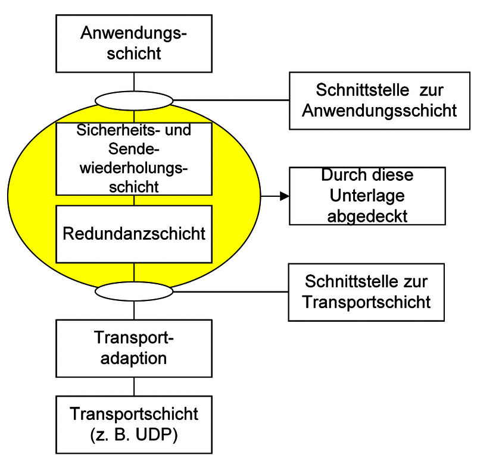
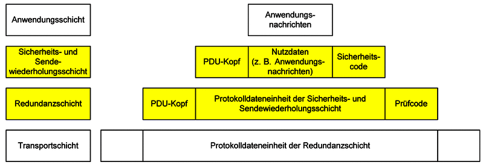
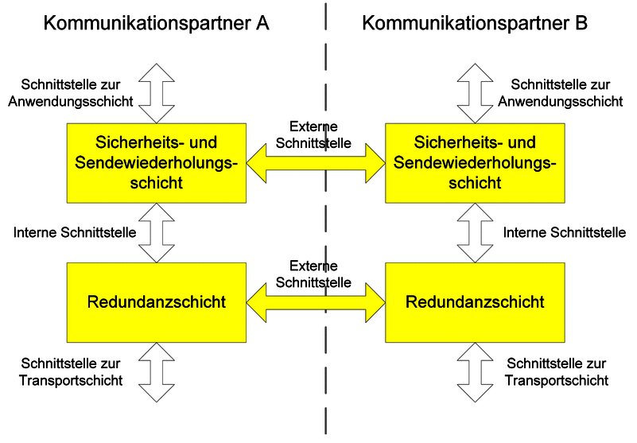

# 2. System Overview

## 2.1 Introduction

The Rail Safe Transport Application (RaSTA) protocol is a standardized communication protocol developed for safety-related railway signalling and control systems. It provides secure, deterministic, and highly available communication between distributed railway applications while remaining independent of the underlying communication technology.

Unlike conventional communication protocols, RaSTA assumes that the transmission network cannot always be trusted. Messages may be delayed, corrupted, duplicated, reordered, or even lost during transmission. Consequently, the protocol performs its own communication supervision instead of relying solely on the transport layer.

The protocol is specified in **DIN VDE V 0831-200** and is designed to satisfy the communication safety principles defined in **DIN EN 50159**. Through a combination of integrity protection, adaptive timing supervision, sequence monitoring, retransmission, and redundancy support, RaSTA provides a communication service suitable for applications requiring high levels of functional safety.

This chapter introduces the overall architecture of the protocol, explains its position within the communication stack, and presents the layered design philosophy upon which the remainder of the report is based.

---

# 2.2 Position of RaSTA within the Communication Architecture

RaSTA is positioned between the application software and the underlying transport network. It provides safety-related communication services without requiring modifications to existing communication infrastructures such as Ethernet or IP networks.

**Figure 2-1.** Classification and delimitation of the RaSTA specification (adapted from DIN VDE V 0831-200 [1]).

Figure 2-1 illustrates the scope of the RaSTA specification. The protocol standard primarily defines two protocol layers:

- **Safety and Retransmission Layer**
- **Redundancy Layer**

These layers together provide the safety-related communication functions required for railway applications. The application layer above RaSTA and the transport technologies below RaSTA are intentionally left outside the scope of the standard.

This separation allows RaSTA to remain largely independent of both the application software and the physical communication infrastructure. Consequently, different railway applications can reuse the same protocol implementation, while different transport technologies can be employed without changing the protocol behaviour.

The standard therefore focuses on defining communication safety mechanisms rather than specifying a complete networking solution.

---

# 2.3 Layered Protocol Architecture

The layered architecture is one of the key design principles of the RaSTA protocol.

**Figure 2-2.** RaSTA protocol layers and message structure (adapted from DIN VDE V 0831-200 [1]).

As shown in Figure 2-2, communication is divided into several independent layers.

At the top of the architecture, the application layer generates safety-related information such as signalling commands, status information, or diagnostic data. The application itself is not responsible for communication safety.

Instead, every outgoing message is first processed by the **Safety and Retransmission Layer**. This layer adds protocol control information including sequence numbers, timestamps, sender and receiver identifiers, and message integrity protection. It also supervises communication timing and performs retransmissions whenever communication errors occur.

The processed message is then passed to the **Redundancy Layer**, whose responsibility is to increase communication availability. When multiple transport channels are available, identical protocol messages are transmitted simultaneously over each channel. At the receiving side, the redundancy layer reconstructs a single logical communication channel from the available physical channels.

Finally, the transport adaptation forwards the completed protocol message using existing communication technologies such as UDP or TCP over IP networks.

This modular architecture separates communication safety from data transmission, allowing each protocol layer to perform a dedicated engineering function while minimizing dependencies between layers.

---

# 2.4 Separation of Responsibilities

A notable feature of the RaSTA architecture is that each protocol layer is responsible for a specific set of communication tasks.

| Protocol Layer | Primary Responsibility |
|---------------|------------------------|
| Application Layer | Generates and consumes application data. |
| Safety and Retransmission Layer | Communication safety, integrity verification, sequencing, timing supervision, retransmission, connection management. |
| Redundancy Layer | Communication availability through multiple transport channels. |
| Transport Adaptation | Mapping protocol messages to the underlying transport service. |
| Transport Layer | Physical transmission of protocol messages. |

**Table 2-1. Responsibilities of the protocol layers.**

This strict separation simplifies implementation and verification. Each layer can evolve independently as long as the interfaces between layers remain unchanged.

Furthermore, faults occurring in one layer remain isolated and cannot directly modify the behaviour of the remaining protocol layers.

---

# 2.5 Protocol Interfaces

Communication between the protocol layers is achieved through standardized interfaces.

**Figure 2-3.** Interfaces within the RaSTA protocol stack (adapted from DIN VDE V 0831-200 [1]).

The protocol specification distinguishes between **compatibility-relevant** and **non-compatibility-relevant** interfaces.

Compatibility-relevant interfaces define the externally observable behaviour of the protocol and therefore must be implemented exactly as specified by the standard. These include protocol message formats, protocol state transitions, communication procedures, and message validation rules. Compliance with these requirements ensures interoperability between independent RaSTA implementations.

Non-compatibility-relevant interfaces describe interactions between the protocol and its surrounding software environment, such as the application programming interface or the transport adaptation layer. These interfaces may differ between implementations provided that the externally visible protocol behaviour remains unchanged.

This distinction provides implementation flexibility while preserving protocol interoperability across different railway systems.

---

# 2.6 Communication Model

RaSTA assumes that the communication network itself does not guarantee safe transmission. Instead, communication safety is achieved entirely through protocol mechanisms implemented within the Safety and Retransmission Layer.

Consequently, the protocol treats the transport network as a best-effort communication service capable of introducing faults such as:

- Message corruption
- Message duplication
- Message loss
- Message reordering
- Excessive communication delay
- Temporary communication interruption

Rather than attempting to prevent these faults, RaSTA continuously monitors communication and detects their occurrence before the received information reaches the application layer.

This philosophy differs significantly from traditional communication protocols, where reliable network infrastructure is often assumed. In RaSTA, safety is achieved through protocol supervision rather than network reliability.

---

# 2.7 Overview of Protocol Operation

From a high-level perspective, communication proceeds through the following sequence:

1. The application requests the establishment of a communication connection.
2. The Safety and Retransmission Layer performs a protocol handshake.
3. Once synchronization has been completed, application data is transmitted.
4. Every transmitted message is continuously supervised using integrity verification, sequence monitoring, adaptive timing, and heartbeat messages.
5. Whenever communication errors occur, retransmission or redundancy mechanisms attempt to restore correct communication.
6. If safe communication can no longer be guaranteed, the protocol terminates the connection and enters a predefined safe state.

This operational philosophy ensures that communication remains deterministic throughout the complete lifetime of every connection.

---

# 2.8 Section Summary

This chapter introduced the overall architecture of the RaSTA protocol and its position within the railway communication stack. The layered design clearly separates application functionality, communication safety, redundancy management, and transport services, allowing each layer to perform a dedicated role while maintaining protocol modularity.

The official protocol architecture presented in DIN VDE V 0831-200 demonstrates that communication safety is implemented independently of the underlying transmission technology. Rather than relying on the communication network itself, RaSTA achieves functional safety through protocol-level supervision mechanisms implemented within the Safety and Retransmission Layer.

The following chapter examines the system requirements that motivated the development of these mechanisms and analyses the communication safety objectives derived from DIN EN 50159.