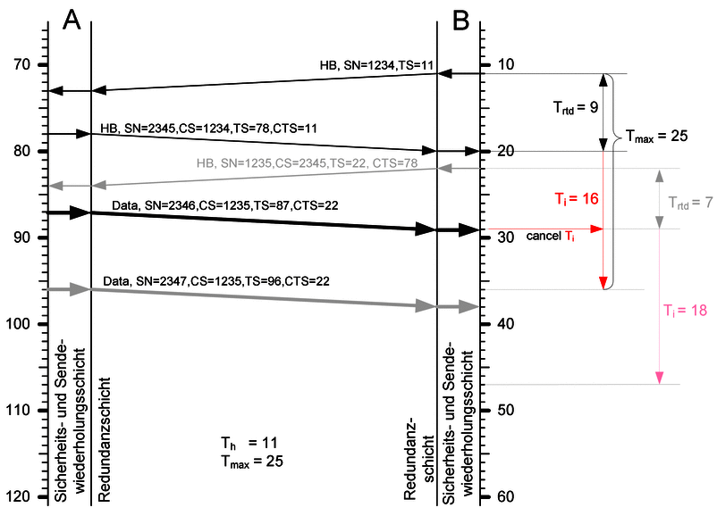

# 4. Mission Critical Functionality

## 4.1 Introduction

The primary purpose of the Rail Safe Transport Application (RaSTA) protocol is to provide safe and highly available communication for railway signalling systems. Unlike conventional communication protocols, RaSTA assumes that communication channels are not inherently reliable and therefore continuously verifies every transmitted message before it is accepted by the receiving application.

The protocol achieves this objective through a collection of independent safety mechanisms operating together throughout the lifetime of every communication connection. These mechanisms detect communication faults, initiate recovery procedures where possible, and transition to a safe state whenever communication integrity can no longer be guaranteed.

This section introduces the mission-critical functions implemented by RaSTA and explains their contribution to railway functional safety.

---

## 4.2 Protocol Interfaces

The communication architecture of RaSTA is organised around clearly defined interfaces between the application layer, the protocol stack, and the transport layer.


**Figure 4-1.** Interfaces within the RaSTA protocol stack (adapted from DIN VDE V 0831-200 [1]).

As shown in Figure 4-1, the protocol separates application-specific behaviour from communication safety. The application layer exchanges user data with the Safety and Retransmission Layer, while the transport adaptation exchanges protocol data units with the underlying transport network.

This separation allows different railway applications to use the same communication protocol without modifying the safety mechanisms.

---

## 4.3 Mission-Critical Safety Functions

RaSTA implements several independent safety functions that operate continuously during communication.

The principal safety functions are:

| Function                       | Purpose                                                                 |
| ------------------------------ | ----------------------------------------------------------------------- |
| Connection Establishment       | Safely initializes communication between two RaSTA instances            |
| Message Integrity Verification | Detects message corruption using an MD4 safety code                     |
| Sequence Supervision           | Detects missing, repeated, or out-of-order messages                     |
| Timeliness Monitoring          | Detects messages that arrive too late                                   |
| Heartbeat Supervision          | Confirms continued availability of communication partners               |
| Retransmission                 | Recovers messages lost during transmission                              |
| Redundancy                     | Improves communication availability through multiple transport channels |
| Safe Disconnection             | Terminates unsafe communication                                         |

**Table 4-1.** Mission-critical protocol functions.

Each function contributes independently to the overall communication safety argument.

---

## 4.4 Adaptive Channel Monitoring

One of the most important safety mechanisms implemented by RaSTA is adaptive channel monitoring.



**Figure 4-2.** Adaptive channel monitoring process (adapted from DIN VDE V 0831-200 [1]).

Rather than relying on fixed communication timeouts, RaSTA continuously measures the communication behaviour between the two protocol instances.

The protocol evaluates:

* Round-trip delay (**Trtd**)
* Connection supervision delay (**Talive**)
* Maximum acceptable message age (**Tmax**)

Using these values, the receiver dynamically calculates the supervision timeout:

```text
Ti = Trtd + Talive + Tmax
```

Whenever a valid protocol message containing a newer Confirmed Timestamp (CTS) is received, the supervision timer is restarted.

If no valid message is received before the timer expires, the connection is considered unsafe and is terminated.

This adaptive mechanism allows RaSTA to tolerate normal communication delays while still detecting abnormal behaviour.

---

## 4.5 Message Integrity Protection

Every protocol message contains a safety code generated using the MD4 message digest algorithm.

The safety code is calculated over the protocol data unit before transmission.

Upon reception, the receiver recalculates the safety code and compares it with the transmitted value.

If the values differ:

* the message is discarded,
* an error counter is incremented,
* the application never receives the corrupted information.

This mechanism protects against accidental communication corruption.

---

## 4.6 Sequence Number Supervision

RaSTA assigns a sequence number to every transmitted protocol data unit.

The receiver continuously compares the received sequence number with the expected value.

This mechanism detects:

* Message loss
* Message repetition
* Message insertion
* Message replay
* Incorrect message ordering

If the received sequence number is not the expected value, the protocol initiates the retransmission procedure.

---

## 4.7 Heartbeat Supervision

Communication may remain idle for extended periods when no application data needs to be exchanged.

To ensure that communication partners remain operational during these periods, RaSTA periodically transmits heartbeat messages.

Heartbeat messages provide three important functions:

* Connection supervision
* Availability monitoring
* Timeliness verification

The heartbeat interval is determined by the configurable parameter **Th**.

Whenever ordinary data messages are transmitted, they also satisfy the heartbeat requirement.

---

## 4.8 Retransmission Mechanism

Sequence supervision allows the receiver to detect missing protocol messages.

Instead of immediately terminating communication, RaSTA attempts to recover the missing information.

The recovery procedure consists of:

1. Detecting the missing sequence number.
2. Sending a Retransmission Request (RetrReq).
3. Receiving a Retransmission Response (RetrResp).
4. Receiving the missing Retransmitted Data (RetrData).
5. Returning to normal communication.

Only user-data messages are retransmitted. Connection-management messages are never retransmitted.

---

## 4.9 Redundancy Mechanism

Communication availability is increased through the Redundancy Layer.

The same protocol message is transmitted simultaneously over one or more independent transport channels.

The receiver compares incoming copies, removes duplicates, restores the correct sequence, and forwards only a single verified message to the Safety and Retransmission Layer.

As a result, communication may continue successfully even when one physical transport channel experiences failures.

---

## 4.10 Safe Failure Behaviour

A fundamental principle of functional safety is that uncertain communication shall never be accepted.

Whenever RaSTA detects a condition that cannot be safely corrected, including:

* Invalid safety code,
* Timeout expiration,
* Retransmission failure,
* Protocol version mismatch,
* Sequence number violations,

the protocol generates a Disconnect Request (DiscReq) and transitions to the **Closed** state.

This fail-safe behaviour ensures that unsafe communication never reaches the application.

---

## 4.11 Section Summary

The mission-critical functions described in this section form the foundation of RaSTA's functional safety architecture.

Rather than relying on a single protection mechanism, the protocol combines integrity verification, sequence supervision, adaptive timing, heartbeat monitoring, retransmission, redundancy, and deterministic failure handling.

Together, these mechanisms provide the communication safety required by modern railway signalling systems and establish the basis for the detailed protocol architecture examined in the following section.
