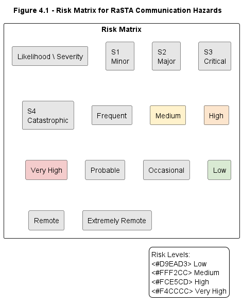

# 4. Mission-Critical Functionality

## 4.1 Introduction

RaSTA (Rail Safe Transport Application) is a safety-related communication protocol designed for railway signalling systems. Its primary objective is to provide secure and highly available communication between distributed signalling components while satisfying the requirements of DIN EN 50159 [1][2].

Unlike conventional communication protocols, RaSTA incorporates multiple independent safety mechanisms that continuously monitor communication correctness, timeliness, and availability. These mechanisms ensure that communication faults are either corrected or detected before they can influence the behaviour of a safety-related application.

The mission-critical functions of RaSTA are:

1. Safe connection establishment
2. Message integrity protection
3. Sequence integrity supervision
4. Timeliness supervision
5. Connection monitoring
6. Retransmission of lost messages
7. Communication redundancy
8. Safe connection termination

---

## 4.2 Hazard Classification

Communication failures in railway signalling systems may lead to incorrect control decisions, loss of train protection information, or delayed execution of safety functions.

The qualitative risk assessment used in this report is illustrated in Figure 4-1.



**Figure 4-1:** Qualitative risk matrix used for hazard classification.

Communication-related hazards considered in this report include:

| Hazard ID | Description                       |
| --------- | --------------------------------- |
| H-1       | Corrupted message accepted        |
| H-2       | Delayed message accepted          |
| H-3       | Lost message undetected           |
| H-4       | Repeated message accepted         |
| H-5       | Unauthorized sender accepted      |
| H-6       | Message sequence error undetected |
| H-7       | Complete communication failure    |

**Table 4-1:** Communication hazards addressed by RaSTA.

---

## 4.3 Safe Connection Establishment

Before application data can be exchanged, RaSTA establishes a connection using a controlled handshake procedure.

The connection establishment sequence is:

```text
Client                          Server

ConnReq ----------------------->

                     <---------- ConnResp

HB ---------------------------->

Connection State = Up
```

**Figure 4-2:** Connection establishment sequence.

The protocol automatically assigns roles:

* Lower identifier → Client
* Higher identifier → Server

During connection establishment the following parameters are exchanged:

* Protocol version
* Sender identifier
* Receiver identifier
* Initial sequence number
* Receive buffer size (Nsendmax)
* Timestamp information

A connection becomes operational only after successful completion of all three steps [1].

---

## 4.4 Message Integrity Protection

One of the primary safety functions of RaSTA is the detection of message corruption.

Every Safety and Retransmission Layer message contains a safety code.

The standard defines three options:

| Option | Safety Code       |
| ------ | ----------------- |
| 1      | No safety code    |
| 2      | Lower half of MD4 |
| 3      | Full MD4          |

**Table 4-2:** Safety code options defined by RaSTA.

The safety code is calculated using the protocol data unit contents and verified upon reception.

The mechanism protects against:

* Data corruption
* Unauthorized modification
* Invalid message insertion

If verification fails, the message is discarded immediately [1][9].

---

## 4.5 Example RaSTA Telegram

The RaSTA standard provides the following message structure for heartbeat messages.

| Field                     | Example Value           |
| ------------------------- | ----------------------- |
| Message Length            | 36                      |
| Message Type              | 6220 (Heartbeat)        |
| Receiver ID               | 987654                  |
| Sender ID                 | 123456                  |
| Sequence Number           | 100                     |
| Confirmed Sequence Number | 99                      |
| Timestamp                 | 34567                   |
| Confirmed Timestamp       | 34450                   |
| Safety Code               | 93 9F 1C 86 59 CF F5 03 |

**Table 4-3:** Example heartbeat telegram derived from the RaSTA protocol format.

Before acceptance, the receiver verifies:

1. Safety code
2. Sender identifier
3. Receiver identifier
4. Sequence number
5. Confirmed sequence number
6. Timestamp information

Only messages passing all checks are delivered to the application layer.

---

## 4.6 Sequence Integrity Supervision

RaSTA uses sequence numbers to ensure ordered communication.

Each message contains:

* Sequence Number (SN)
* Confirmed Sequence Number (CS)

The receiver continuously compares the received sequence number against the expected value.

Example:

```text
Expected SN = 25
Received SN = 26
```

Result:

```text
Sequence Error Detected
```

Sequence supervision protects against:

* Message repetition
* Replay
* Message loss
* Message insertion
* Message resequencing

These threats are explicitly identified in DIN EN 50159 [2].

---

## 4.7 Timeliness Supervision

Correct information can become unsafe if it is delivered too late.

RaSTA continuously supervises message timeliness using:

* Timestamp (TS)
* Confirmed Timestamp (CTS)
* Round-trip delay (Trtd)
* Connection supervision delay (Talive)

The supervision timeout is calculated as:

```text
Ti = Trtd + Talive + Tmax
```

where:

* Ti = supervision timeout
* Tmax = maximum acceptable message age

If Ti expires, the connection is considered unsafe and is terminated [1].

This mechanism provides protection against the delay threat defined by DIN EN 50159 [2].

---

## 4.8 Heartbeat Supervision

Heartbeat messages maintain connection supervision when no application data is available.

Message Type:

```text
6220 (Heartbeat)
```

Heartbeat messages are transmitted after the configured interval:

```text
Th
```

Their functions include:

* Monitoring remote availability
* Updating timing measurements
* Maintaining protocol synchronization
* Preventing unnecessary connection termination

Heartbeat messages therefore act as both a liveness check and a timing reference [1].

---

## 4.9 Retransmission of Lost Messages

Lost messages are detected through sequence-number supervision.

Example:

```text
Expected SN = 25
Received SN = 26
```

The receiver initiates a retransmission procedure:

```text
RetrReq
      →
RetrResp
      →
RetrData
```

The sender retransmits all unacknowledged messages beginning with the missing sequence number.

This mechanism increases communication availability while preserving message ordering [1].

---

## 4.10 Communication Redundancy

The Redundancy Layer provides protection against transport-channel failures.

A redundancy channel may consist of multiple transport channels:

```text
Transport Channel A
Transport Channel B
Transport Channel C
```

The same message is transmitted on all channels using:

* Identical payload
* Identical sequence number
* Identical CRC value

Failure of a single transport channel therefore does not necessarily interrupt communication [1].

---

## 4.11 Safe Failure Behaviour

When communication validity can no longer be guaranteed, RaSTA transitions to a safe state.

Typical causes include:

* Timeout expiration
* Invalid protocol version
* Sequence-number violation
* Retransmission failure
* Invalid protocol flow

The protocol transmits:

```text
DiscReq
```

and enters the Closed state.

This ensures that unsafe communication is never forwarded to the application [1].

---

## 4.12 Summary

RaSTA implements multiple independent safety mechanisms that collectively provide safe communication for railway signalling systems.

| Safety Objective   | RaSTA Mechanism     |
| ------------------ | ------------------- |
| Integrity          | MD4 Safety Code     |
| Authenticity       | Sender/Receiver IDs |
| Sequence Integrity | SN and CS           |
| Timeliness         | TS, CTS, Ti         |
| Availability       | Redundancy Layer    |
| Recovery           | Retransmission      |
| Safe Failure       | DiscReq             |

**Table 4-4:** Mapping of safety objectives to protocol mechanisms.

These mechanisms form the foundation for compliance with DIN EN 50159 and support the safe operation of railway signalling applications.
