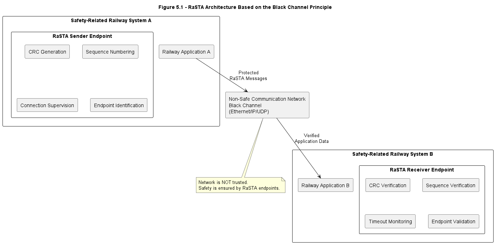
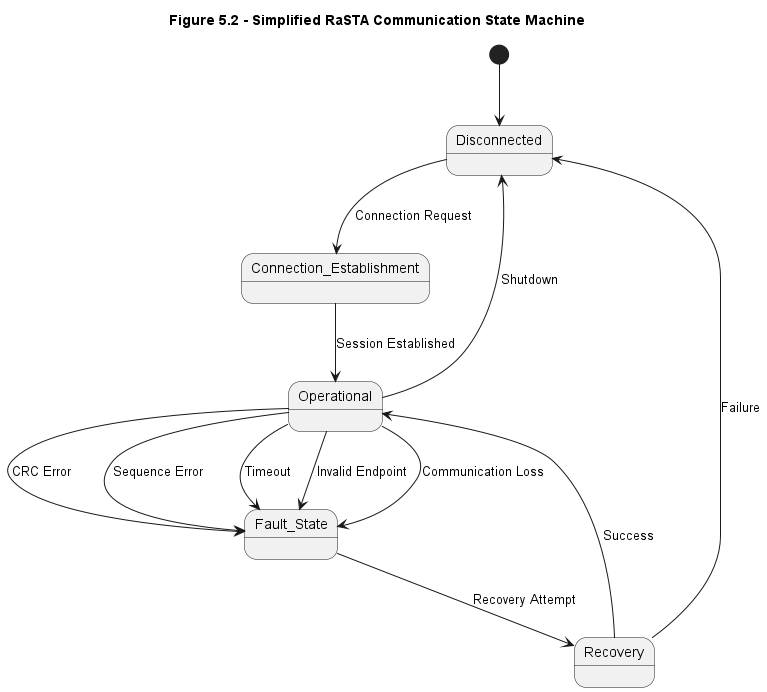

# 5. System Architecture

## 5.1 Overview

RaSTA is implemented as a layered communication architecture designed to provide both functional safety and high availability. The protocol stack is independent of the application layer and can operate over standard transport services such as UDP and TCP.

The architecture consists of three logical levels:

1. Application Layer
2. Safety and Retransmission Layer
3. Redundancy Layer
4. Transport Layer

The Safety and Retransmission Layer implements all safety-related communication functions, while the Redundancy Layer improves availability by utilizing one or more transport channels.



**Figure 5-1:** RaSTA layered architecture based on DIN VDE V 0831-200 [1].

---

## 5.2 Safety and Retransmission Layer

The Safety and Retransmission Layer is responsible for ensuring safe communication according to DIN EN 50159.

Its responsibilities include:

* Connection establishment
* Message integrity verification
* Sequence supervision
* Timeliness supervision
* Heartbeat generation
* Flow control
* Retransmission handling
* Safe connection termination

All safety decisions are made within this layer.

---

## 5.3 Safety and Retransmission Protocol Data Unit

Every Safety and Retransmission Layer message uses a common protocol format.

| Byte Position | Length   | Content                   |
| ------------- | -------- | ------------------------- |
| 0–1           | 2        | Message Length            |
| 2–3           | 2        | Message Type              |
| 4–7           | 4        | Receiver ID               |
| 8–11          | 4        | Sender ID                 |
| 12–15         | 4        | Sequence Number           |
| 16–19         | 4        | Confirmed Sequence Number |
| 20–23         | 4        | Timestamp                 |
| 24–27         | 4        | Confirmed Timestamp       |
| 28–(n)        | Variable | User Data                 |
| End           | 8 or 16  | Safety Code               |

**Table 5-1:** Safety and Retransmission Layer PDU structure [1].

The message length field specifies the total size of the protocol data unit.

The sender and receiver identifiers uniquely identify the communication participants within a RaSTA network.

The sequence-number fields provide message-order supervision, while timestamps provide timeliness monitoring.

The safety code protects message integrity.

---

## 5.4 Message Types

RaSTA defines eight protocol message types.

| Message Type | Decimal Value | Purpose                 |
| ------------ | ------------- | ----------------------- |
| ConnReq      | 6200          | Connection Request      |
| ConnResp     | 6201          | Connection Response     |
| RetrReq      | 6212          | Retransmission Request  |
| RetrResp     | 6213          | Retransmission Response |
| DiscReq      | 6216          | Disconnect Request      |
| HB           | 6220          | Heartbeat               |
| Data         | 6240          | User Data               |
| RetrData     | 6241          | Retransmitted Data      |

**Table 5-2:** Safety and Retransmission Layer message types [1].

These messages support connection establishment, normal communication, error recovery, and safe termination.

---

## 5.5 Example Heartbeat Telegram

The following example illustrates a heartbeat message using the structure defined by the RaSTA specification.

| Field                     | Example Value           |
| ------------------------- | ----------------------- |
| Message Length            | 36                      |
| Message Type              | 6220                    |
| Receiver ID               | 987654                  |
| Sender ID                 | 123456                  |
| Sequence Number           | 100                     |
| Confirmed Sequence Number | 99                      |
| Timestamp                 | 34567                   |
| Confirmed Timestamp       | 34450                   |
| Safety Code               | 93 9F 1C 86 59 CF F5 03 |

**Table 5-3:** Example heartbeat telegram.

Before acceptance, the receiver verifies:

1. Safety code
2. Sender identifier
3. Receiver identifier
4. Sequence number
5. Confirmed sequence number
6. Timestamp information

Only messages passing all checks are processed.

---

## 5.6 Connection Establishment Architecture

Before user data transmission, a connection must be established.

RaSTA uses a three-message handshake:

```text
Client                         Server

ConnReq ---------------------->

                    <---------- ConnResp

HB --------------------------->

Connection State = Up
```

**Figure 5-2:** Connection establishment sequence.

The communication partner with the lower identifier acts as the client, while the higher identifier acts as the server.

During connection establishment the following parameters are exchanged:

* Protocol version
* Sender identifier
* Receiver identifier
* Initial sequence numbers
* Receive buffer size
* Timestamp information

This process ensures synchronized protocol operation.

---

## 5.7 Protocol State Machine

The Safety and Retransmission Layer operates using six protocol states.

| State   | Description                        |
| ------- | ---------------------------------- |
| Closed  | Connection terminated              |
| Down    | Ready for connection establishment |
| Start   | Connection setup in progress       |
| Up      | Operational communication          |
| RetrReq | Retransmission requested           |
| RetrRun | Retransmission running             |

**Table 5-4:** Safety and Retransmission Layer states.



**Figure 5-3:** State machine of the Safety and Retransmission Layer.

Only the Up state permits normal application-data exchange.

Any serious protocol violation results in a transition to the Closed state.

---

## 5.8 Timeliness Architecture

RaSTA continuously monitors communication timing.

The protocol maintains:

* Round-trip delay (Trtd)
* Connection supervision delay (Talive)
* Maximum message age (Tmax)

The adaptive timeout is calculated as:

```text
Ti = Trtd + Talive + Tmax
```

If Ti expires, the connection is considered unsafe and is terminated.

This mechanism protects against excessive communication delay and stale information.

---

## 5.9 Flow Control Architecture

Flow control prevents receive-buffer overflow when communication partners have different processing capabilities.

During connection establishment, both partners exchange:

```text
Nsendmax
```

which represents the receive-buffer capacity.

The sender may not exceed the number of unacknowledged messages permitted by the receiver.

This mechanism prevents excessive message accumulation and improves communication stability.

---

## 5.10 Retransmission Architecture

Lost messages are detected using sequence supervision.

Example:

```text
Expected SN = 25
Received SN = 26
```

This indicates loss of message 25.

The retransmission sequence is:

```text
RetrReq
      →
RetrResp
      →
RetrData
```

The sender retransmits all unacknowledged messages beginning with the missing sequence number.

This mechanism restores communication without violating message ordering.

---

## 5.11 Redundancy Layer

The Redundancy Layer provides communication availability through redundant transport channels.

Its responsibilities include:

* Multi-channel transmission
* CRC verification
* Sequence supervision
* Duplicate elimination
* Out-of-sequence buffering

A redundancy channel may consist of one or more physical transport channels.

The same message is transmitted on all channels using identical sequence numbers.

---

## 5.12 Redundancy Layer Protocol Data Unit

The Redundancy Layer uses its own protocol format.

| Field           | Length          |
| --------------- | --------------- |
| Length          | 2 Bytes         |
| Reserved        | 2 Bytes         |
| Sequence Number | 4 Bytes         |
| User Data       | Variable        |
| CRC             | 0, 2 or 4 Bytes |

**Table 5-5:** Redundancy Layer protocol data unit [1].

The sequence number is incremented for every transmitted message.

The same sequence number must be used on all transport channels carrying the same message.

---

## 5.13 CRC Protection

The Redundancy Layer supports multiple CRC options.

| Option | Algorithm            |
| ------ | -------------------- |
| A      | None                 |
| B      | CRC32 (0xEE5B42FD)   |
| C      | CRC32C (0x1EDC6F41)  |
| D      | CRC16-CCITT (0x1021) |
| E      | CRC16 (0x8005)       |

**Table 5-6:** Redundancy Layer CRC options [1].

CRC verification improves error detection on individual transport channels and contributes to communication availability.

---

## 5.14 Redundancy Channel Model

The Redundancy Layer forms a single logical communication channel from multiple physical transport channels.

```text
                Logical Redundancy Channel
                         |
      -----------------------------------------
      |                   |                   |
 Channel A           Channel B           Channel C
```

Messages received from different channels are combined into a single message stream.

The receiver suppresses duplicates and maintains message ordering.

---

## 5.15 DeferQueue Architecture

Messages may arrive out of sequence because transport channels have different delays.

Such messages are temporarily stored in a DeferQueue.

Messages remain buffered until:

1. The missing message arrives, or
2. Timeout Tseq expires.

The DeferQueue increases availability while preserving deterministic message ordering.

---

## 5.16 Architecture Summary

The RaSTA architecture combines safety and availability mechanisms in separate protocol layers.

The Safety and Retransmission Layer provides:

* Integrity
* Timeliness
* Sequence supervision
* Connection monitoring

The Redundancy Layer provides:

* Channel redundancy
* CRC protection
* Duplicate suppression
* Message reordering

Together, these layers provide a communication architecture capable of satisfying the safety and availability requirements of railway signalling applications.
