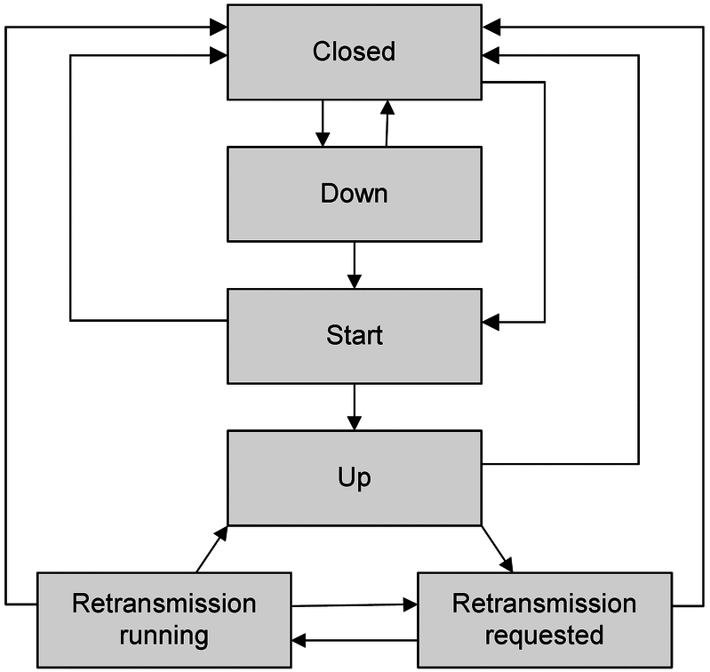
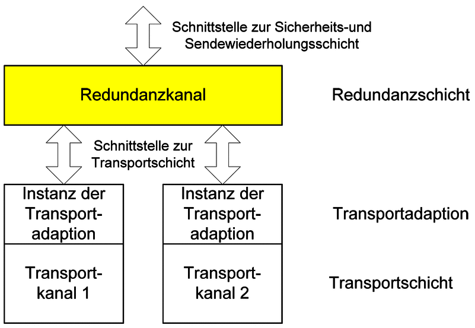
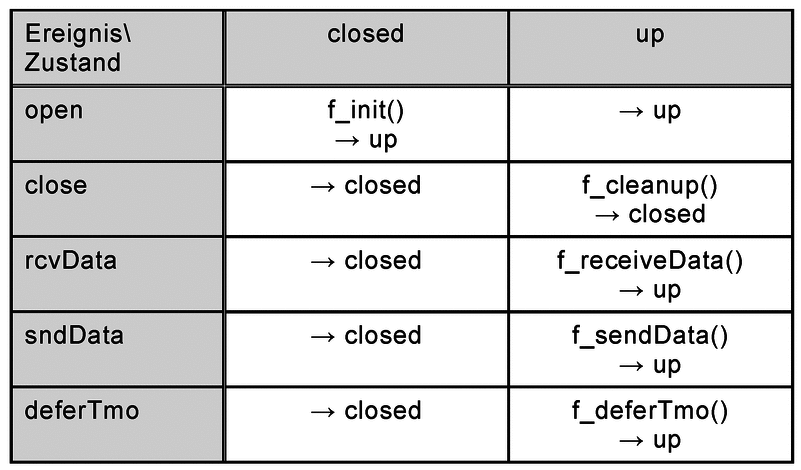
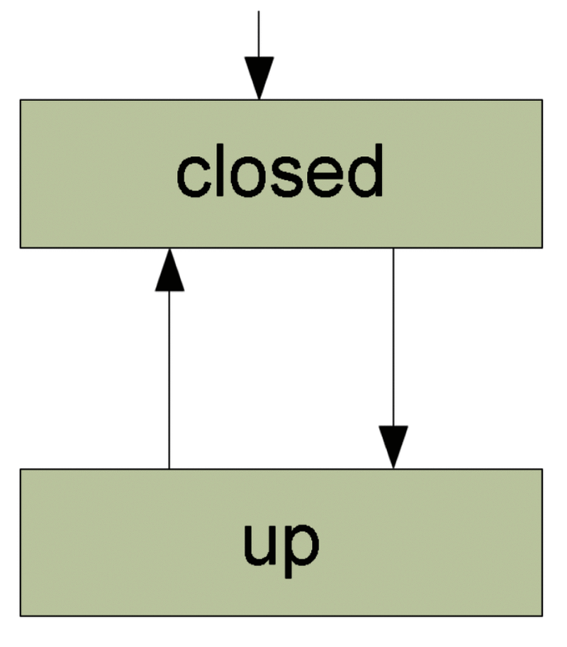
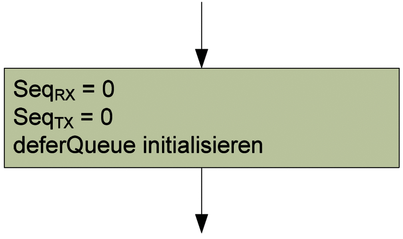
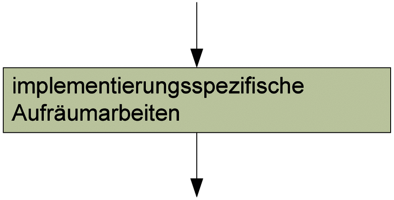
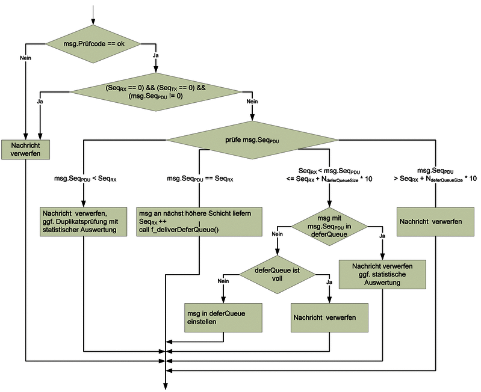
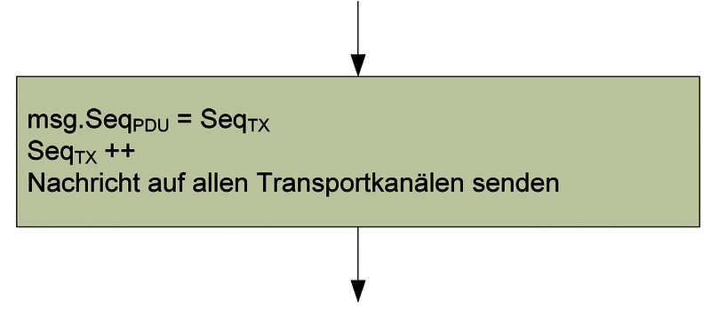
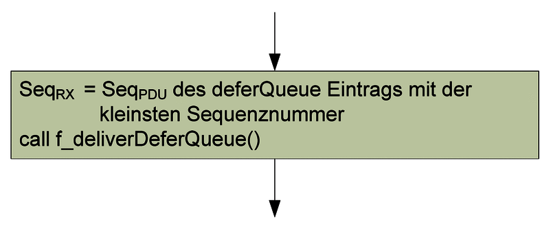
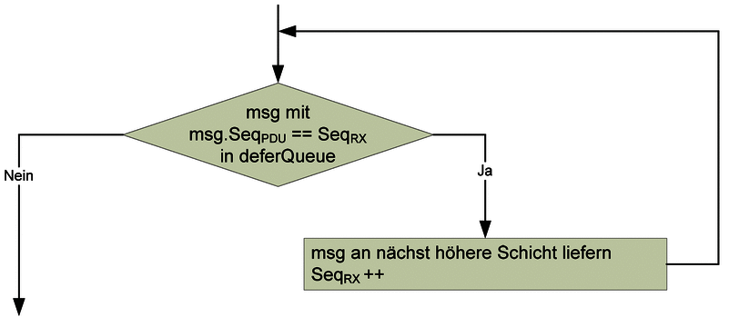

# 5. System Architecture

## 5.1 Introduction

The Rail Safe Transport Application (RaSTA) protocol achieves functional safety through a modular architecture that separates communication safety from communication availability. Instead of implementing all protocol functions within a single software component, RaSTA divides its responsibilities into independent protocol layers, each performing a clearly defined task.

This architectural separation provides several important engineering advantages. It simplifies implementation, improves maintainability, enables independent verification of protocol components, and allows the protocol to operate over different transport technologies without affecting safety-related behaviour.

Unlike conventional communication protocols that rely heavily on reliable transport services, RaSTA assumes that the underlying communication network may introduce message corruption, duplication, delays, or packet loss. Consequently, all safety-related verification is performed inside the protocol itself.

This chapter examines the internal architecture defined by **DIN VDE V 0831-200**, beginning with the layered protocol structure before analysing protocol messages, connection establishment, state machines, retransmission, and redundancy.

---

## 5.2 Layered Architecture

The RaSTA protocol is organised into two principal protocol layers:

- Safety and Retransmission Layer
- Redundancy Layer

Together these layers provide both communication safety and communication availability.

**Figure 5-1. Layered architecture of the RaSTA protocol (adapted from DIN VDE V 0831-200 [1]).**

The **Application Layer** generates signalling information such as movement authorities, status information, or diagnostic data. It has no knowledge of the communication mechanisms implemented by RaSTA.

The **Safety and Retransmission Layer** forms the core of the protocol. Every outgoing application message passes through this layer before transmission. It performs message integrity verification, sequence supervision, adaptive timing supervision, heartbeat generation, retransmission, connection management, and flow control.

Below the Safety Layer, the **Redundancy Layer** improves communication availability. If multiple transport channels exist, identical protocol messages are transmitted simultaneously through each channel. At the receiving side, the redundancy layer reconstructs a single logical communication channel before forwarding messages to the Safety Layer.

Finally, the **Transport Layer** carries the completed protocol message using technologies such as UDP or TCP over Ethernet.

This layered organisation ensures that communication safety remains independent of the transport technology while allowing the protocol to operate over different network infrastructures without modification.

---

## 5.3 Responsibilities of the Protocol Layers

Each protocol layer performs a dedicated engineering function.

| Protocol Layer | Primary Responsibility |
|---------------|------------------------|
| Application | Generates and consumes railway signalling information. |
| Safety and Retransmission Layer | Communication safety, message integrity, timing supervision, retransmission, connection management. |
| Redundancy Layer | Communication availability through multiple transport channels. |
| Transport Adaptation | Maps RaSTA messages onto the selected transport protocol. |
| Transport Layer | Physical transmission of protocol data. |

**Table 5-1. Responsibilities of the RaSTA protocol layers.**

Separating these responsibilities simplifies protocol verification because each layer can be analysed independently while preserving the externally observable behaviour defined by the standard.

---

## 5.4 Safety and Retransmission Layer

The Safety and Retransmission Layer implements the majority of the protocol mechanisms responsible for functional safety.

Its principal responsibilities include:

- establishing communication,
- supervising protocol states,
- verifying message integrity,
- monitoring sequence numbers,
- detecting communication timeouts,
- generating heartbeat messages,
- requesting retransmission,
- performing flow control,
- terminating unsafe communication.

Unlike ordinary transport protocols, this layer continuously evaluates communication correctness rather than assuming that the transport network provides reliable delivery.

Every received protocol message is verified before being accepted.

If verification fails, the protocol either initiates recovery or safely terminates the communication session.

This behaviour represents the primary safety barrier between the railway signalling application and the communication network.

---

## 5.5 Protocol Interfaces

Communication between the protocol layers is performed through standardised interfaces defined by DIN VDE V 0831-200.

**Figure 5-2. Interfaces within the RaSTA protocol stack (adapted from DIN VDE V 0831-200 [1]).**

The specification distinguishes between **compatibility-relevant** and **non-compatibility-relevant** interfaces.

Compatibility-relevant interfaces define externally observable protocol behaviour, including message formats, protocol state transitions, sequence number processing, and communication procedures. Every compliant RaSTA implementation must implement these interfaces exactly as specified to ensure interoperability.

Non-compatibility-relevant interfaces connect the protocol to the application software and the transport adaptation layer. These interfaces may vary between implementations provided that the externally visible protocol behaviour remains unchanged.

This separation enables manufacturers to optimise software architecture while maintaining full compatibility with other RaSTA implementations.

---

## 5.6 Protocol Data Unit

Every message exchanged between two RaSTA instances is encapsulated inside a **Protocol Data Unit (PDU)**.

The protocol data unit contains both application information and protocol control information required for communication supervision.

The general structure is summarised in Table 5-2.

| Field | Purpose |
|--------|---------|
| Message Length | Total protocol message size |
| Message Type | Identifies the protocol function |
| Receiver ID | Identifies the destination |
| Sender ID | Identifies the source |
| Sequence Number | Maintains communication order |
| Confirmed Sequence Number | Acknowledges previously received messages |
| Timestamp | Supports adaptive timing supervision |
| Confirmed Timestamp | Confirms previous timing information |
| User Data | Application payload |
| Security Code | Protects message integrity |

**Table 5-2. General structure of the RaSTA Protocol Data Unit (adapted from DIN VDE V 0831-200 [1]).**

Unlike ordinary communication protocols, every protocol message simultaneously performs several communication safety functions.

The sequence numbers supervise communication order.

The timestamps support adaptive timeout calculation.

The sender and receiver identifiers prevent communication with unintended protocol partners.

Finally, the Security Code protects the complete protocol message against accidental modification during transmission.

The protocol therefore combines multiple independent safety mechanisms within every transmitted message without requiring additional supervisory traffic.

---

## 5.7 Protocol Message Types

RaSTA defines a small number of specialised protocol messages that collectively support the complete communication lifecycle.

| Message | Purpose |
|----------|---------|
| Connection Request | Begins communication establishment. |
| Connection Response | Confirms communication parameters. |
| Data | Transfers application information. |
| Heartbeat | Supervises communication during idle periods. |
| Retransmission Request | Requests missing messages. |
| Retransmission Response | Confirms retransmission. |
| Retransmitted Data | Resends previously lost application data. |
| Disconnect Request | Safely terminates communication. |

**Table 5-3. Principal protocol messages defined by RaSTA.**

Although only a limited number of message types exist, they support all protocol operations including connection establishment, communication supervision, error recovery, and safe connection termination.

Every message follows the same protocol data unit structure introduced previously. Consequently, the receiver processes all protocol messages using a common verification procedure before applying message-specific behaviour.

---

## 5.8 Section Summary

This first part introduced the internal architecture of the RaSTA protocol. The layered organisation clearly separates communication safety from communication availability while allowing the protocol to operate independently of the underlying transport technology.

The Safety and Retransmission Layer provides the principal communication safety mechanisms, whereas the Redundancy Layer improves communication availability. Together they form a modular protocol architecture capable of supporting safety-related railway communication.

The following section examines how these protocol messages are used during connection establishment, including the three-stage handshake, protocol version negotiation, and synchronization of communication partners before application data exchange begins.

## 5.9 Connection Establishment

Before any application data can be exchanged, the communication partners must establish a synchronized communication session. This initialization procedure ensures that both sides share identical protocol parameters and communication context before entering normal operation.

Unlike conventional networking protocols, where communication may begin immediately after a simple connection request, RaSTA performs a structured handshake that verifies protocol compatibility, synchronizes sequence numbers, exchanges communication parameters, and establishes timing supervision.

Only after all verification steps have been completed successfully does the protocol permit safety-related application data to be transmitted.

The complete communication procedure is illustrated in Figure 5-3.

**Figure 5-3. Successful connection establishment according to DIN VDE V 0831-200 [1].**

The communication sequence consists of three protocol messages:

1. Connection Request (ConnReq)
2. Connection Response (ConnResp)
3. Heartbeat (HB)

Each message contributes to the initialization of the communication context and provides evidence that both communication partners have reached the same protocol state.

---

## 5.10 Connection Request

Communication begins when the client transmits a **Connection Request (ConnReq)**.

This message contains all information required for the receiver to establish a new protocol context.

The principal information exchanged is summarised in Table 5-4.

| Field | Purpose |
|--------|---------|
| Receiver ID | Identifies the destination RaSTA instance |
| Sender ID | Identifies the transmitting RaSTA instance |
| Protocol Version | Indicates the supported protocol version |
| Initial Sequence Number | Defines the starting point for sequence supervision |
| Timestamp | Provides the initial timing reference |
| Receive Buffer Size (Nsendmax) | Advertises receiver capacity |
| Security Code | Protects the complete protocol message |

**Table 5-4. Principal contents of the Connection Request message (adapted from DIN VDE V 0831-200 [1]).**

One important design decision is the use of a **random initial sequence number**.

Rather than beginning every communication session with sequence number zero, RaSTA selects a random starting value for each new connection.

This approach significantly reduces the possibility of replay attacks because messages captured during previous communication sessions cannot accidentally satisfy the sequence verification rules of a newly established connection.

The Connection Request therefore performs much more than requesting communication. It establishes the initial communication context upon which all subsequent safety mechanisms depend.

---

## 5.11 Connection Response

After successfully validating the received Connection Request, the receiver generates a **Connection Response (ConnResp)**.

The Connection Response acknowledges the received request while simultaneously transmitting the receiver's own communication parameters.

The information exchanged is summarised in Table 5-5.

| Field | Purpose |
|--------|---------|
| Receiver ID | Destination communication partner |
| Sender ID | Responding RaSTA instance |
| Protocol Version | Accepted protocol version |
| Initial Sequence Number | Receiver's random sequence number |
| Confirmed Sequence Number | Acknowledges the Connection Request |
| Timestamp | Current communication time |
| Confirmed Timestamp | Confirms the received timestamp |
| Receive Buffer Size | Receiver capacity |
| Security Code | Protects message integrity |

**Table 5-5. Principal contents of the Connection Response message (adapted from DIN VDE V 0831-200 [1]).**

During this stage, both communication partners exchange the parameters required for subsequent communication. In addition to sequence numbers and timing information, the exchange of receive buffer sizes allows the flow control mechanism to operate correctly during normal communication.

Every field contained within the Connection Response is verified before communication proceeds.

---

## 5.12 Completion of the Handshake

The final stage of the initialization procedure is the transmission of a **Heartbeat (HB)** message by the client.

Although Heartbeat messages are primarily used during normal operation to supervise communication, the first Heartbeat serves a special purpose during connection establishment.

Its successful reception confirms that:

- both communication partners have synchronized sequence numbers;
- protocol versions are compatible;
- timing information has been exchanged successfully;
- communication parameters have been accepted by both sides.

Only after this Heartbeat has been received do both protocol instances transition into the **Up** state.

At this point the communication channel is considered operational, and application data may be exchanged safely.

This additional confirmation step distinguishes RaSTA from many conventional communication protocols and significantly increases confidence that both communication partners possess an identical communication context before normal operation begins.

---

## 5.13 Protocol Version Negotiation

Compatibility between protocol implementations is verified during connection establishment.

Every Connection Request contains the protocol version supported by the initiating communication partner.

The receiver compares this version with its own implementation before accepting the connection.

Three situations are possible:

- Both communication partners support the same protocol version.
- One communication partner supports a newer but compatible version.
- The protocol versions are incompatible.

If compatibility cannot be established, communication is terminated immediately.

The protocol never attempts to exchange safety-related information using incompatible implementations because differences in protocol interpretation could lead to unpredictable behaviour.

Version negotiation therefore represents an additional layer of protection that preserves interoperability while maintaining deterministic communication behaviour.

---

## 5.14 Functional Safety Contribution

The connection establishment procedure provides the foundation for all subsequent protocol operation.

Rather than simply opening a communication channel, the handshake establishes a synchronized protocol context shared by both communication partners.

From a functional safety perspective, this procedure provides several important benefits:

- Prevents communication with incompatible protocol implementations.
- Synchronizes sequence numbers before application data exchange.
- Establishes adaptive timing supervision.
- Exchanges communication buffer capacities.
- Prevents replay attacks through random sequence number initialization.
- Confirms that both protocol instances have reached identical communication states.

Only after every verification step has completed successfully does the protocol permit application messages to influence the railway signalling system.

Consequently, the connection establishment procedure represents the first safety barrier implemented by the RaSTA protocol before normal communication begins.

---

## 5.15 Section Summary

This section analysed the connection establishment procedure defined by DIN VDE V 0831-200. Through the exchange of the Connection Request, Connection Response, and Heartbeat messages, both communication partners establish a synchronized communication context before application data transmission begins.

The handshake performs considerably more than simply opening a communication session. It synchronizes protocol versions, sequence numbers, timing information, communication buffers, and sender identification while simultaneously protecting against replay attacks and incompatible implementations.

The next section examines how this synchronized communication context is maintained throughout the lifetime of the connection using the Safety and Retransmission Layer state machine, heartbeat supervision, and deterministic protocol state transitions.

## 5.16 Safety and Retransmission Layer State Machine

Once the communication handshake has been completed successfully, the Safety and Retransmission Layer controls all subsequent protocol behaviour through a deterministic state machine. Every protocol event—whether initiated by the application, generated internally, or received from the communication partner—is processed according to predefined state transition rules specified in DIN VDE V 0831-200.

Unlike conventional communication protocols that may permit implementation-specific behaviour, RaSTA defines exactly one valid response for every combination of communication state and protocol event. This deterministic behaviour is essential for railway signalling systems because it ensures that independent implementations react identically under identical operating conditions.

The state machine of the Safety and Retransmission Layer is shown in Figure 5-4.

**Figure 5-4. State machine of the Safety and Retransmission Layer (adapted from DIN VDE V 0831-200 [1]).**

The state machine governs every stage of communication, including connection establishment, normal operation, retransmission, and safe disconnection. By defining explicit transitions between protocol states, the specification eliminates ambiguity and greatly simplifies protocol verification.

---

## 5.17 Communication States

The Safety and Retransmission Layer defines six operational states that together represent the complete lifecycle of a communication session.

| State | Description |
|--------|-------------|
| **Closed** | No communication session exists. |
| **Down** | Communication initialization is in progress. |
| **Start** | Connection establishment handshake is being executed. |
| **Up** | Normal communication is active. |
| **RetrReq** | Retransmission has been requested. |
| **RetrRun** | Missing messages are currently being retransmitted. |

**Table 5-6. Communication states of the Safety and Retransmission Layer.**

Communication always begins in the **Closed** state.

Following an application request to establish communication, the protocol initializes its internal variables and transitions to the **Down** and **Start** states while the connection establishment handshake is performed.

Once synchronization has been completed successfully, both communication partners enter the **Up** state.

The **Up** state represents normal protocol operation and remains active for the majority of the communication session.

Whenever sequence supervision detects missing protocol messages, communication temporarily enters the retransmission states (**RetrReq** and **RetrRun**) until synchronization has been restored.

If recovery fails or communication correctness can no longer be guaranteed, the protocol returns immediately to the **Closed** state.

---

## 5.18 Deterministic State Transitions

One of the defining characteristics of RaSTA is that protocol behaviour depends not only on the received message but also on the current communication state.

For example:

- A **Connection Request** is accepted only during connection establishment.
- **Application Data** is processed only while the protocol is in the **Up** state.
- **Retransmission Responses** are accepted only during retransmission.
- Messages received in inappropriate states are rejected immediately.

This state-dependent processing prevents invalid protocol sequences from influencing the signalling application.

Because every state transition is explicitly defined by the standard, different manufacturers implementing RaSTA will always process identical protocol events in the same manner.

This deterministic behaviour is particularly important for interoperability and safety certification, where predictable protocol behaviour is mandatory.

---

## 5.19 Heartbeat Supervision

During periods of normal communication, application messages naturally confirm that both communication partners remain operational.

However, signalling systems frequently experience periods during which no application data needs to be exchanged.

Without additional supervision, communication failures occurring during these idle periods could remain undetected.

To prevent this situation, RaSTA periodically transmits **Heartbeat (HB)** messages whenever the configurable heartbeat interval (**Th**) expires without application traffic.

Heartbeat messages do not contain application data. Instead, they carry the protocol control information required to continue communication supervision, including sequence numbers, timestamps, and message integrity protection.

Every valid Heartbeat received by the communication partner confirms that:

- communication remains operational;
- sequence synchronization is maintained;
- timing supervision remains valid;
- both protocol instances continue operating correctly.

Heartbeat messages therefore extend communication supervision throughout the entire lifetime of the connection, regardless of application traffic.

---

## 5.20 Adaptive Communication Monitoring

Heartbeat messages work together with the adaptive timing mechanism introduced earlier in the report.

Rather than using fixed timeout values, RaSTA continuously measures communication behaviour and adjusts its supervision timers according to observed network performance.

The protocol evaluates several timing parameters, including:

- transmission delay,
- processing delay,
- heartbeat interval,
- message age,
- communication drift.

This adaptive supervision enables the protocol to distinguish between temporary communication fluctuations and genuine communication failures.

Consequently, unnecessary protocol disconnects are avoided while genuine communication faults are detected rapidly.

Compared with conventional fixed-time supervision, this adaptive approach provides greater robustness when operating over modern packet-switched communication networks.

---

## 5.21 Functional Safety Contribution

The state machine and heartbeat supervision mechanisms provide the behavioural framework upon which the remaining RaSTA safety functions operate.

From a functional safety perspective they provide several important benefits:

- deterministic communication behaviour;
- continuous supervision during both active and idle communication;
- prevention of invalid protocol sequences;
- rapid detection of communication interruptions;
- predictable recovery following communication faults;
- safe transition to predefined protocol states.

Together these mechanisms ensure that communication remains continuously supervised throughout the lifetime of every connection.

Whenever communication correctness can no longer be demonstrated, the protocol intentionally leaves the operational state and transitions into a predefined safe condition.

This deterministic fail-safe behaviour represents one of the fundamental design principles of the RaSTA protocol.

---

## 5.22 Section Summary

This section examined the behavioural architecture of the Safety and Retransmission Layer. The protocol state machine defines every permitted communication state and explicitly specifies how protocol events shall be processed throughout the communication lifecycle.

Heartbeat supervision and adaptive timing complement the state machine by continuously monitoring communication availability, ensuring that failures are detected even during periods without application traffic.

These mechanisms establish the behavioural foundation upon which the remaining communication safety functions—sequence supervision, retransmission, flow control, and redundancy—operate.

## 5.23 Sequence Number Supervision

After communication has entered the **Up** state, every transmitted protocol message receives a unique **Sequence Number (SN)**. These sequence numbers enable the receiving communication partner to verify that messages are received exactly once and in the correct order.

Unlike conventional communication protocols that primarily use sequence numbers to improve reliability, RaSTA employs sequence supervision as a fundamental safety mechanism. Every received message is compared against the next expected sequence number before it is accepted by the application.

If the received sequence number matches the expected value, the message is processed normally. If a sequence discontinuity is detected, the protocol immediately concludes that communication has been disturbed and initiates the retransmission procedure.

Sequence supervision enables the protocol to detect several communication faults simultaneously, including:

- Message loss
- Message duplication
- Message replay
- Message resequencing
- Unexpected message insertion

By verifying every transmitted message, RaSTA ensures that only a complete and correctly ordered communication stream reaches the railway signalling application.

---

## 5.24 Confirmed Sequence Numbers

In addition to ordinary sequence numbers, every protocol message also contains a **Confirmed Sequence Number (CS)**.

Rather than transmitting dedicated acknowledgement packets, RaSTA acknowledges previously received messages by embedding the confirmed sequence number inside subsequent outgoing messages.

Three internal variables are maintained:

| Variable | Description |
|----------|-------------|
| **CST** | Confirmed sequence number transmitted to the communication partner |
| **CSR** | Most recent confirmed sequence number received |
| **CSPDU** | Confirmed sequence number contained within the received protocol message |

**Table 5-7. Confirmed sequence number variables used by the Safety and Retransmission Layer.**

Whenever a valid message is received, its sequence number is stored internally and later returned to the sender as part of the next outgoing protocol message.

This acknowledgement mechanism enables the sender to determine exactly which messages have already been received successfully and which messages remain buffered for possible retransmission.

The use of implicit acknowledgements reduces protocol overhead while maintaining deterministic communication behaviour.

---

## 5.25 Flow Control

Reliable communication requires that neither communication partner transmits messages faster than the other can process them.

RaSTA addresses this problem through a deterministic flow control mechanism based on the configuration parameter **Nsendmax**.

During connection establishment, both communication partners exchange their receive buffer capacities.

The sender continuously monitors the number of transmitted but unacknowledged protocol messages.

If this number reaches the receiver's advertised buffer capacity, further transmissions are temporarily suspended until acknowledgements become available.

Unlike conventional congestion control algorithms that adapt to network conditions, RaSTA flow control focuses on maintaining deterministic communication behaviour and preventing receiver buffer overflow.

Consequently, communication performance remains predictable even when the processing capabilities of both communication partners differ significantly.

---

## 5.26 Packetization

Many railway applications generate numerous small messages within short time intervals.

Sending each message individually would increase communication overhead and reduce transmission efficiency.

To improve bandwidth utilisation, RaSTA supports **packetization**, allowing multiple application messages to be combined into a single protocol data unit.

Each application message is preceded by its own length field, enabling the receiver to reconstruct the original message boundaries after reception.

The maximum number of application messages that may be combined is defined by the configuration parameter **NmaxPackage**.

Although packetization improves communication efficiency, it remains completely transparent to the signalling application.

After reception, the Safety and Retransmission Layer separates the individual application messages before forwarding them to the application software.

This design improves communication efficiency without affecting application behaviour or protocol safety.

---

## 5.27 Retransmission Mechanism

Despite the high reliability of modern railway communication networks, temporary packet loss cannot be completely eliminated.

Rather than immediately terminating communication whenever a message is lost, RaSTA attempts controlled recovery using its retransmission mechanism.

The retransmission procedure begins whenever the receiver detects a discontinuity in the sequence numbers.

Instead of forwarding incomplete information to the application, the receiver performs the following sequence:

1. Detect the missing sequence number.
2. Suspend application data delivery.
3. Generate a **Retransmission Request (RetrReq)**.
4. Wait for the sender's response.
5. Receive the missing application messages.
6. Restore sequence synchronization.
7. Resume normal communication.

Only after the missing messages have been received successfully does the protocol release the buffered application data.

This procedure guarantees that the application never observes incomplete communication.

---

## 5.28 Retransmission States

Retransmission introduces two dedicated protocol states.

| State | Description |
|--------|-------------|
| **RetrReq** | Waiting for retransmission after detecting a missing message. |
| **RetrRun** | Processing retransmitted messages while restoring synchronization. |

**Table 5-8. Retransmission states of the Safety and Retransmission Layer.**

These states temporarily interrupt normal application communication while protocol consistency is restored.

If retransmission completes successfully, communication returns automatically to the **Up** state.

If retransmission cannot be completed before the adaptive supervision timer expires, communication is terminated safely.

This behaviour demonstrates one of the fundamental design principles of RaSTA:

> **Attempt recovery whenever communication can still be restored safely. Otherwise, terminate communication before unsafe information reaches the signalling application.**

---

## 5.29 Functional Safety Contribution

The mechanisms presented in this section operate together to preserve communication consistency throughout the complete communication session.

Sequence supervision detects communication disturbances.

Confirmed sequence numbers acknowledge successful reception.

Flow control prevents communication overload.

Packetization improves transmission efficiency.

Retransmission restores temporarily lost information while preventing incomplete communication from reaching the application.

Collectively, these mechanisms provide an additional layer of protection that complements the state machine and heartbeat supervision analysed previously.

Instead of assuming perfect communication, RaSTA continuously validates every transmitted message and performs corrective actions whenever inconsistencies are detected.

This layered verification strategy significantly improves both communication reliability and functional safety.

## 5.30 Redundancy Layer

The Safety and Retransmission Layer guarantees communication correctness. However, communication correctness alone is not sufficient for railway signalling systems. High operational availability is equally important because unnecessary communication interruptions may reduce railway capacity and system performance.

For this reason, RaSTA introduces a dedicated **Redundancy Layer** whose objective is to improve communication availability without affecting the safety mechanisms implemented by the upper protocol layer.

Unlike the Safety and Retransmission Layer, the Redundancy Layer does not verify application data or communication integrity. Instead, it provides a reliable transport service by managing multiple independent communication channels and presenting them as a single logical channel to the upper protocol layer.

This clear separation of responsibilities allows safety and availability to be addressed independently while maintaining a modular protocol architecture.

---

## 5.31 Channel Model

The redundancy concept implemented by RaSTA is illustrated by the channel model shown below.

**Figure 5-5. Channel model of the Redundancy Layer (adapted from DIN VDE V 0831-200 [1]).**

Instead of transmitting messages over only one physical communication channel, the Redundancy Layer simultaneously forwards identical protocol messages through every configured transport channel.

Examples include:

- Ethernet Channel A
- Ethernet Channel B
- Optical Fibre
- Wireless Communication

At the receiving side, duplicate protocol messages are recognised using redundancy sequence numbers.

The first correctly received message is immediately forwarded to the Safety and Retransmission Layer.

Additional copies arriving later are discarded after diagnostic evaluation.

Consequently, the upper protocol layers remain completely independent of the physical communication infrastructure.

---

## 5.32 Event-State Matrix

The behaviour of the Redundancy Layer is formally defined by an event-state matrix.

**Figure 5-6. Event-state matrix of the Redundancy Layer (adapted from DIN VDE V 0831-200 [1]).**

The matrix specifies how every incoming protocol event shall be processed depending on the current communication state.

Unlike the Safety and Retransmission Layer, which manages several operational states, the Redundancy Layer performs only a limited number of state transitions.

Nevertheless, every event is still processed deterministically.

This deterministic processing guarantees that different RaSTA implementations will react identically under identical communication conditions.

---

## 5.33 Redundancy State Machine

The operational behaviour of the Redundancy Layer is illustrated by its state machine.

**Figure 5-7. State transitions of the Redundancy Layer (adapted from DIN VDE V 0831-200 [1]).**

Only two operational states are defined.

| State | Description |
|--------|-------------|
| **Closed** | No redundancy channel exists. |
| **Up** | Redundancy communication is active. |

**Table 5-9. Operational states of the Redundancy Layer.**

The simplicity of the redundancy state machine reflects the specialised purpose of this protocol layer.

Rather than supervising communication correctness, the Redundancy Layer concentrates exclusively on providing highly available communication services for the Safety and Retransmission Layer.

---

## 5.34 Principal Redundancy Functions

The behaviour of the Redundancy Layer is implemented through several internal functions defined by DIN VDE V 0831-200.

These functions are presented in the following figures.

### Initialization

**Figure 5-8. Function `f_init()` (adapted from DIN VDE V 0831-200 [1]).**

The `f_init()` function creates a new redundancy context, initializes sequence numbers, clears internal queues, configures timers, and prepares the communication channels before data transmission begins.

---

### Cleanup

**Figure 5-9. Function `f_cleanup()` (adapted from DIN VDE V 0831-200 [1]).**

When communication terminates, the `f_cleanup()` function releases all allocated protocol resources, resets timers, clears buffered messages, and returns the redundancy layer to the Closed state.

---

### Receiving Data

**Figure 5-10. Function `f_receiveData()` (adapted from DIN VDE V 0831-200 [1]).**

The `f_receiveData()` function validates incoming redundancy messages, verifies redundancy sequence numbers, detects duplicates, and determines whether received messages should be forwarded immediately or temporarily stored inside the Defer Queue.

This function forms the principal decision point of the Redundancy Layer.

---

### Sending Data

**Figure 5-11. Function `f_sendData()` (adapted from DIN VDE V 0831-200 [1]).**

The `f_sendData()` function duplicates every outgoing protocol message and transmits identical copies through every configured transport channel.

By distributing messages across independent communication paths, the protocol significantly increases communication availability without modifying the behaviour of the Safety Layer.

---

### Defer Queue Timeout

**Figure 5-12. Function `f_deferTmo()` (adapted from DIN VDE V 0831-200 [1]).**

Messages arriving earlier than expected are stored temporarily inside the Defer Queue.

The `f_deferTmo()` function supervises the associated timeout (**Tseq**).

If the missing message does not arrive before the timeout expires, the queued message is released to the upper protocol layer according to the redundancy rules defined by the specification.

---

### Delivering Deferred Messages

**Figure 5-13. Function `f_deliverDeferQueue()` (adapted from DIN VDE V 0831-200 [1]).**

Whenever the expected message arrives successfully, the `f_deliverDeferQueue()` function removes the stored messages from the Defer Queue and forwards them to the Safety and Retransmission Layer in the correct order.

This mechanism allows the Redundancy Layer to compensate for temporary differences in transport channel latency while preserving deterministic message sequencing.

---

## 5.35 Contribution of the Redundancy Layer to Functional Safety

Although the Redundancy Layer primarily improves communication availability, it also contributes indirectly to functional safety.

Multiple communication channels reduce the probability that a single transport failure interrupts communication.

The Defer Queue preserves correct message ordering despite differences in transport latency.

Duplicate detection prevents multiple copies of the same message from reaching the Safety Layer.

Most importantly, the Redundancy Layer performs these functions transparently.

The Safety and Retransmission Layer continues operating exactly as if only one communication channel existed.

This separation allows both protocol layers to remain relatively simple while collectively providing both communication safety and high availability.

---

## 5.36 Chapter Summary

This chapter examined the complete architecture of the Rail Safe Transport Application protocol.

The analysis began with the layered organisation of the protocol before examining the Safety and Retransmission Layer, protocol data units, connection establishment, deterministic state management, heartbeat supervision, sequence verification, retransmission, and finally the Redundancy Layer.

The architecture demonstrates one of the strongest characteristics of RaSTA: the separation of communication safety from communication availability.

The Safety and Retransmission Layer ensures that only correct information reaches the railway signalling application, while the Redundancy Layer increases communication robustness by managing multiple transport channels transparently.

Together these layers provide a modular, deterministic, and highly dependable communication architecture that satisfies the functional safety objectives required for modern railway signalling systems.

The following chapter analyses the operational scenarios defined by DIN VDE V 0831-200 to demonstrate that these architectural mechanisms operate correctly during both normal and fault conditions.

