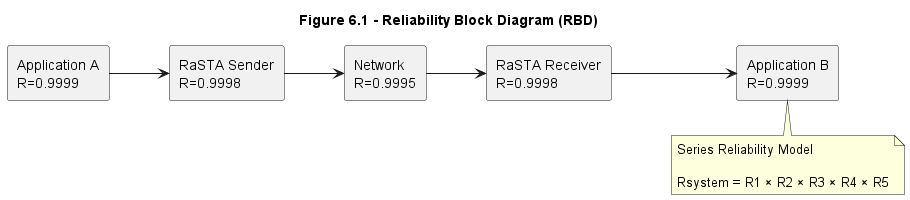

# 6. Proof of Correct Functional Operation

## 6.1 Introduction

The objective of this section is to demonstrate that RaSTA performs its intended communication functions correctly under both normal and abnormal operating conditions.

The analysis is based on the protocol behaviour specified in DIN VDE V 0831-200 Version 03.03 and examines:

* Connection establishment
* Data transmission
* Timeliness supervision
* Heartbeat supervision
* Retransmission behaviour
* Redundancy operation
* Fault handling

The analysis uses actual protocol mechanisms defined by the standard rather than theoretical assumptions.

---

## 6.2 Verification Strategy

Correct functional operation is demonstrated by verifying that:

1. Connections are established correctly.
2. Messages are delivered correctly.
3. Lost messages are recovered.
4. Corrupted messages are rejected.
5. Delayed messages are detected.
6. Communication failures result in safe behaviour.

The protocol mechanisms are evaluated against the requirements defined in Section 3.

---

## 6.3 Verification of Connection Establishment

RaSTA establishes communication using a three-message handshake procedure.

```text
Client                          Server

ConnReq ----------------------->

                     <---------- ConnResp

HB ---------------------------->

Connection State = Up
```

**Figure 6-1:** Connection establishment sequence.

The connection request contains:

* Protocol version
* Sender identifier
* Receiver identifier
* Initial sequence number
* Receive buffer size

The connection response confirms these parameters.

The final heartbeat message confirms successful synchronization.

Only after this sequence is completed does the protocol enter the operational state **Up**.

### Verification Result

The handshake ensures that:

* Both communication partners use compatible protocol versions.
* Sender and receiver identifiers are verified.
* Sequence-number synchronization is achieved.
* Communication cannot begin in an undefined state.

Therefore the connection-establishment mechanism satisfies its intended function [1].

---

## 6.4 Verification of Message Integrity

Every Safety and Retransmission Layer message contains an MD4-based safety code.

Example:

| Field           | Value                   |
| --------------- | ----------------------- |
| Message Type    | HB (6220)               |
| Sequence Number | 100                     |
| Timestamp       | 34567                   |
| Safety Code     | 93 9F 1C 86 59 CF F5 03 |

**Table 6-1:** Example protected message.

When the receiver obtains a message:

1. The safety code is recalculated.
2. The received value is compared with the calculated value.
3. Messages failing verification are discarded.

### Verification Result

Any corruption of the protected message fields causes a safety-code mismatch.

Therefore message corruption cannot propagate to the application layer [1][2].

---

## 6.5 Verification of Sequence Integrity

Sequence integrity is achieved through:

* Sequence Number (SN)
* Confirmed Sequence Number (CS)

The receiver continuously checks whether:

```text
Expected SN = Received SN
```

Example:

```text
Expected SN = 25
Received SN = 26
```

Result:

```text
Sequence Error Detected
```

This indicates that message 25 has been lost.

### Threats Detected

Sequence supervision detects:

* Message loss
* Repetition
* Replay
* Message insertion
* Resequencing

These communication threats are identified by DIN EN 50159 [2].

### Verification Result

The sequence-supervision mechanism successfully detects communication anomalies before application processing occurs.

---

## 6.6 Verification of Timeliness Monitoring

Correct information can become unsafe if delivered too late.

RaSTA therefore performs adaptive timeliness supervision using:

* Timestamp (TS)
* Confirmed Timestamp (CTS)
* Round-trip delay (Trtd)
* Connection supervision delay (Talive)

The supervision timeout is calculated as:

```text
Ti = Trtd + Talive + Tmax
```

where:

* Ti = supervision timeout
* Tmax = maximum acceptable message age

### Example

Measured values:

```text
Trtd = 12 ms
Talive = 8 ms
Tmax = 200 ms
```

Result:

```text
Ti = 220 ms
```

If no valid message arrives before timeout expiration, the connection is terminated.

### Verification Result

The mechanism prevents stale information from being accepted by the receiving application [1][2].

---

## 6.7 Verification of Heartbeat Supervision

Heartbeat messages provide continuous monitoring when no application data is available.

Message type:

```text
HB (6220)
```

Heartbeat transmission occurs after:

```text
Th
```

milliseconds without outgoing traffic.

Heartbeat functions include:

* Connection supervision
* Timeliness monitoring
* Availability monitoring
* Synchronization maintenance

### Verification Result

Communication failures remain detectable even when no user data is exchanged [1].

---

## 6.8 Verification of Retransmission Behaviour

The RaSTA specification defines a retransmission mechanism for recovering lost messages.

### Normal Operation

```text
24
25
26
```

### Message Loss

Message:

```text
25
```

is lost.

Receiver observes:

```text
24
26
```

The sequence error triggers retransmission.

### Recovery Procedure

```text
RetrReq
      →
RetrResp
      →
RetrData(25)
RetrData(26)
```

Communication then returns to normal operation.

### Verification Result

The retransmission mechanism restores communication while preserving message order and integrity [1].

---

## 6.9 Verification of Successful Retransmission Scenario

The RaSTA specification provides an example retransmission scenario.

The receiver expects:

```text
SN = 25
```

but receives:

```text
SN = 26
```

The protocol performs:

1. Sequence-error detection.
2. RetrReq transmission.
3. RetrResp reception.
4. Retransmission of missing data.
5. Return to normal communication.

This process is completed without violating sequence integrity.

### Verification Result

Lost messages can be recovered successfully without requiring connection re-establishment.

---

## 6.10 Verification of Failed Retransmission Scenario

The standard also describes a scenario where retransmitted messages are lost repeatedly.

In this case:

```text
RetrData(25)
```

is also lost.

The receiver issues another retransmission request.

If communication cannot be restored before timeout Ti expires:

```text
DiscReq
```

is generated and the connection enters the Closed state.

### Verification Result

Unsafe communication is terminated rather than accepted.

This behaviour is consistent with functional-safety principles [11].

---

## 6.11 Verification of Redundancy Operation

The Redundancy Layer improves communication availability.

A logical redundancy channel may consist of:

```text
Transport Channel A
Transport Channel B
Transport Channel C
```

The same message is transmitted simultaneously on all channels.



**Figure 6-2:** Reliability model of a redundant communication channel.

### Example

Message transmitted:

```text
SN = 100
```

Transport Channel A:

```text
Message Lost
```

Transport Channel B:

```text
Message Delivered
```

The receiver still obtains a valid copy.

### Verification Result

Single-channel failures do not necessarily interrupt communication [1].

---

## 6.12 Verification of DeferQueue Operation

Different transport channels may introduce different delays.

Example:

Expected:

```text
10
```

Received:

```text
11
12
```

Messages 11 and 12 are stored temporarily in the DeferQueue.

When message 10 arrives:

```text
10
```

the queue is released and ordering is restored.

### Verification Result

Message ordering is preserved despite channel-delay differences.

---

## 6.13 Verification of Fault Handling

RaSTA defines deterministic responses for protocol faults.

| Fault                     | Protocol Response      |
| ------------------------- | ---------------------- |
| Invalid Safety Code       | Message Discarded      |
| Invalid Sender ID         | Message Discarded      |
| Invalid Message Type      | Message Discarded      |
| Sequence Error            | Retransmission         |
| Timeout                   | Connection Termination |
| Retransmission Failure    | Connection Termination |
| Protocol Version Mismatch | Connection Rejected    |

**Table 6-2:** Fault handling behaviour.

### Verification Result

The protocol transitions to a safe state whenever communication validity cannot be guaranteed.

---

## 6.14 Functional Correctness Argument

The verification activities demonstrate that:

* Connections are established correctly.
* Messages are protected against corruption.
* Sequence errors are detected.
* Delayed information is detected.
* Lost messages are recovered.
* Communication failures are handled safely.
* Availability is improved through redundancy.

The protocol therefore performs its intended communication functions correctly.

---

## 6.15 Conclusion

The analysis demonstrates that RaSTA satisfies its functional objectives through a combination of:

* Safety-code verification
* Sequence supervision
* Timeliness monitoring
* Heartbeat supervision
* Retransmission procedures
* Redundancy mechanisms
* Safe fault handling

The protocol therefore provides a communication framework suitable for safety-related railway signalling systems operating according to DIN EN 50159 requirements.
