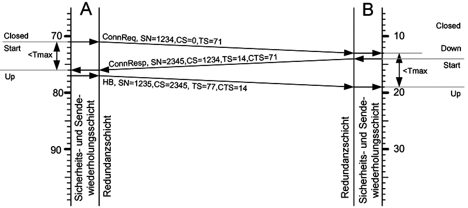
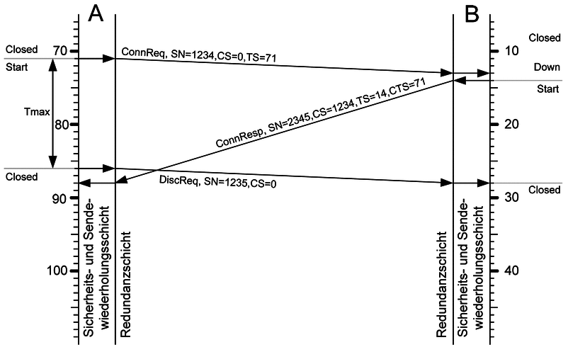
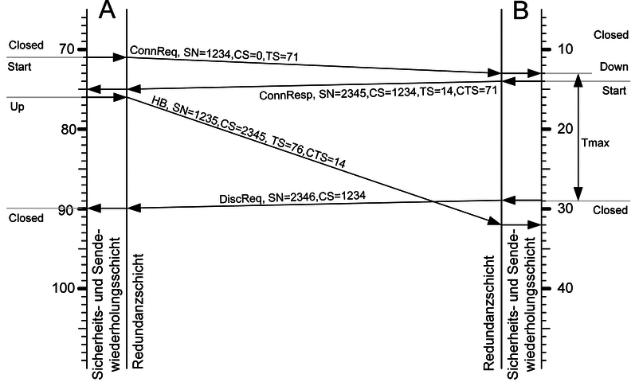
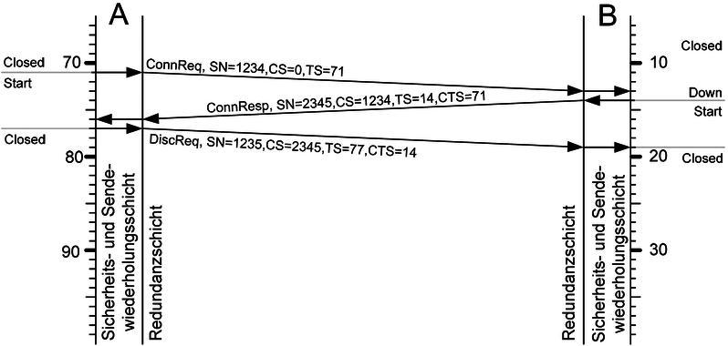
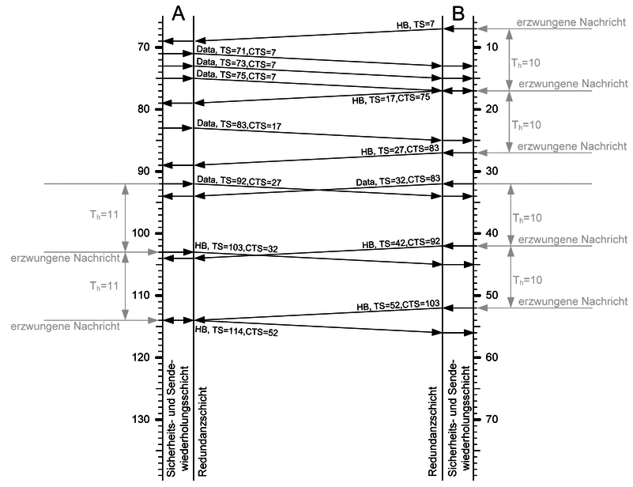
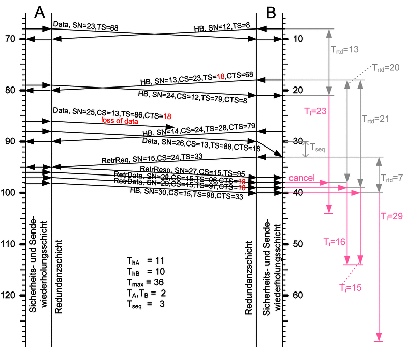
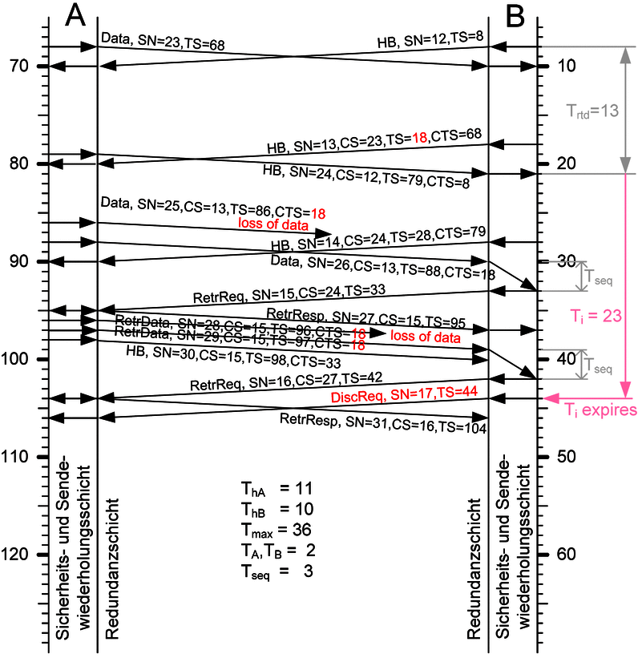

# 6. Proof of Correct Functional Operation

## 6.1 Introduction

The previous chapter examined the architecture of the Rail Safe Transport Application (RaSTA) protocol and explained the mechanisms responsible for ensuring communication safety and availability. While these architectural components describe how the protocol is constructed, they do not by themselves demonstrate that the protocol behaves correctly during real communication.

Functional safety requires evidence that the implemented mechanisms operate correctly under both normal and abnormal operating conditions. For this reason, DIN VDE V 0831-200 provides a number of operational scenarios illustrating how the protocol reacts during connection establishment, communication delays, retransmission, protocol errors, and communication failures.

These scenarios are especially valuable because they demonstrate the interaction between multiple protocol mechanisms. Sequence supervision, heartbeat monitoring, adaptive timing, retransmission, and deterministic state transitions work together to detect, isolate, and recover from communication faults before incorrect information reaches the signalling application.

This chapter analyses the operational scenarios defined by the standard and evaluates how they provide evidence that the protocol satisfies its functional safety objectives.

---

## 6.2 Functional Verification Strategy

Unlike many communication protocols that focus primarily on performance, RaSTA continuously verifies communication correctness throughout the lifetime of every connection.

The protocol evaluates several independent properties simultaneously:

- Message integrity
- Sequence correctness
- Communication timing
- Sender authenticity
- Receiver authenticity
- Connection state
- Communication availability

Only when every verification step is successful is the received message delivered to the signalling application.

This layered verification strategy significantly reduces the probability that communication faults remain undetected.

The operational scenarios analysed in this chapter demonstrate how these verification mechanisms behave during realistic communication situations.

---

## 6.3 Successful Connection Establishment

The first operational scenario illustrates successful initialization of communication between two RaSTA instances.

**Figure 6-1. Successful connection establishment (adapted from DIN VDE V 0831-200 [1]).**

The communication process begins when the client transmits a **Connection Request (ConnReq)**.

The server validates the received request and responds with a **Connection Response (ConnResp)** containing its own communication parameters.

Finally, the client transmits a **Heartbeat (HB)** message confirming that communication synchronization has been completed successfully.

Only after these three protocol messages have been exchanged do both communication partners enter the **Up** state.

At this point, application messages may be exchanged safely.

---

## 6.4 Step-by-Step Analysis

The communication procedure shown in Figure 6-1 can be analysed in four distinct stages.

### Stage 1 – Communication Request

The initiating communication partner sends a Connection Request containing:

- sender identifier,
- receiver identifier,
- protocol version,
- random sequence number,
- timing information,
- receive buffer size.

The receiving communication partner validates every field before continuing.

---

### Stage 2 – Parameter Verification

After successful validation, the receiver creates a Connection Response.

During this step both communication partners verify:

- protocol compatibility,
- communication identifiers,
- receive buffer capacities,
- sequence number initialization,
- message integrity.

If any inconsistency is detected, communication is terminated immediately.

---

### Stage 3 – Synchronization

The client transmits the first Heartbeat message.

Although Heartbeat messages later supervise idle communication, the first Heartbeat has a special purpose.

It confirms that both communication partners have completed initialization successfully and now possess identical protocol contexts.

---

### Stage 4 – Normal Communication

Following successful synchronization, both communication partners transition into the **Up** state.

Normal application communication may now begin.

During this operational phase, every transmitted message continues to perform communication supervision through sequence numbers, timestamps, acknowledgements, and integrity verification.

---

## 6.5 Functional Safety Assessment

The connection establishment scenario demonstrates several important functional safety principles.

First, communication is never established immediately after receiving a Connection Request.

Instead, both communication partners independently verify protocol compatibility before entering operational communication.

Second, random sequence numbers prevent protocol messages belonging to previous communication sessions from being accepted during new communication sessions.

Third, synchronization is not considered complete until the first Heartbeat has been exchanged successfully.

Finally, deterministic state transitions ensure that communication proceeds identically in every compliant RaSTA implementation.

Together these mechanisms establish a trusted communication context before safety-related information is exchanged.

---

## 6.6 Verification Results

The successful connection establishment scenario demonstrates that the protocol satisfies several fundamental communication safety objectives.

| Verification Objective | Result |
|------------------------|--------|
| Protocol compatibility verified | ✓ |
| Sender and receiver identified | ✓ |
| Sequence numbers synchronized | ✓ |
| Adaptive timing initialized | ✓ |
| Communication buffers negotiated | ✓ |
| Safe transition into Up state | ✓ |

**Table 6-1. Functional verification performed during successful connection establishment.**

The analysed scenario demonstrates that communication begins only after every required protocol parameter has been verified successfully.

This conservative initialization procedure significantly reduces the probability that communication faults influence subsequent protocol behaviour.

---

## 6.7 Section Summary

The first operational scenario demonstrates that RaSTA establishes communication through a carefully controlled synchronization procedure rather than a simple connection request.

Every stage of the handshake contributes directly to communication safety by verifying protocol compatibility, synchronizing communication parameters, and confirming that both protocol instances have entered identical operational states.

The following section analyses abnormal connection establishment scenarios, including delayed protocol messages and protocol incompatibilities, to demonstrate how RaSTA behaves when communication initialization cannot be completed successfully.

## 6.8 Delayed Connection Response

Successful communication requires both communication partners to complete the connection establishment procedure within predefined timing limits. If the expected **Connection Response (ConnResp)** does not arrive within the maximum permissible time, the protocol assumes that communication cannot be established safely.

The following scenario illustrates this situation.

**Figure 6-2. Delayed Connection Response during connection establishment (adapted from DIN VDE V 0831-200 [1]).**

After transmitting the Connection Request, the initiating communication partner starts a supervision timer.

Normally, the receiver validates the request and immediately returns a Connection Response. However, if the response is delayed because of communication failures, excessive network latency, or receiver malfunction, the supervision timer eventually expires.

Rather than waiting indefinitely, the client terminates the connection attempt and returns to the **Closed** state.

No application data is exchanged because synchronization between both communication partners has not yet been completed.

---

### Technical Analysis

The timeout mechanism serves several important engineering purposes.

First, it prevents protocol resources from remaining allocated indefinitely during failed connection attempts.

Second, it avoids communication using incomplete synchronization information.

Finally, it guarantees deterministic behaviour because every implementation responds identically whenever the timeout expires.

The timeout therefore acts as an additional communication safety barrier during protocol initialization.

---

### Functional Safety Assessment

From a functional safety perspective, delaying communication is preferable to accepting uncertain communication.

If a delayed Connection Response were accepted after the protocol context had already become invalid, communication partners could begin exchanging messages using inconsistent sequence numbers or outdated timing information.

By immediately terminating unsuccessful connection attempts, RaSTA ensures that every communication session begins from a fully synchronized state.

---

## 6.9 Delayed Heartbeat

The final stage of connection establishment requires transmission of the first **Heartbeat (HB)** message.

Although Heartbeat messages later supervise idle communication, the first Heartbeat has a special role because it confirms successful synchronization between both communication partners.

The following scenario demonstrates communication failure caused by an excessive Heartbeat delay.

**Figure 6-3. Delayed Heartbeat during connection establishment (adapted from DIN VDE V 0831-200 [1]).**

After receiving the Connection Response, the server waits for the synchronization Heartbeat generated by the client.

If the Heartbeat arrives within the configured supervision interval, communication enters the **Up** state.

However, if the Heartbeat is delayed beyond the permitted timeout, the synchronization procedure remains incomplete.

The server therefore concludes that communication cannot be trusted and immediately terminates the connection establishment procedure.

Both communication partners return to the **Closed** state.

---

### Technical Analysis

The first Heartbeat performs two independent functions.

It confirms that the client has received and accepted the Connection Response.

It also verifies that both communication partners have entered identical protocol states before application communication begins.

Without this confirmation, the server cannot distinguish between successful initialization and communication failure.

Consequently, the synchronization Heartbeat provides the final verification step before operational communication.

---

### Functional Safety Assessment

This scenario demonstrates the conservative design philosophy adopted throughout RaSTA.

Rather than assuming that communication has been established successfully after transmitting the Connection Response, the protocol requires explicit confirmation from the communication partner.

Only after receiving this confirmation does communication become operational.

This approach significantly reduces the probability of partially initialized communication sessions.

---

## 6.10 Client-Detected Protocol Error

Another important operational scenario concerns protocol errors detected during connection establishment.

The following figure illustrates communication termination after the client detects an invalid Connection Response.

**Figure 6-4. Client-detected protocol error during connection establishment (adapted from DIN VDE V 0831-200 [1]).**

After receiving the Connection Response, the client performs several verification procedures before accepting the communication session.

Typical verification steps include:

- Protocol version compatibility
- Sender identification
- Receiver identification
- Security Code verification
- Message format verification
- Sequence number validation

If any verification step fails, the Connection Response is rejected immediately.

Instead of attempting communication using uncertain protocol parameters, the client generates a **Disconnect Request** and terminates the communication session.

Communication therefore returns directly to the **Closed** state.

---

### Technical Analysis

Unlike many general-purpose communication protocols, RaSTA performs protocol verification before communication becomes operational.

Every field contained within the Connection Response contributes to communication correctness.

If one parameter differs from the expected value, deterministic communication can no longer be guaranteed.

For this reason, the protocol rejects the complete communication session instead of attempting partial recovery.

---

### Functional Safety Assessment

Protocol compatibility is fundamental to functional safety.

Even small implementation differences could result in two communication partners interpreting identical protocol messages differently.

Such inconsistent behaviour would violate the deterministic operation required by railway signalling systems.

By validating every protocol parameter before entering the operational state, RaSTA prevents incompatible implementations from exchanging safety-related information.

---

## 6.11 Evaluation of Connection Establishment Failures

The three failure scenarios analysed in this section demonstrate that RaSTA never attempts to establish communication under uncertain conditions.

Instead, communication is permitted only after all synchronization procedures have completed successfully.

The analysed scenarios show that the protocol correctly detects:

- delayed communication,
- missing synchronization,
- incompatible protocol implementations,
- invalid protocol parameters.

Whenever one of these conditions occurs, the protocol terminates communication before application data can be exchanged.

This behaviour reflects the fail-safe philosophy of railway communication systems, where communication uncertainty is considered more hazardous than temporary communication interruption.

---

## 6.12 Section Summary

The abnormal connection establishment scenarios provide further evidence that RaSTA satisfies the functional safety principles defined by DIN EN 50159.

Delayed protocol messages, missing synchronization, and protocol incompatibilities are all detected before operational communication begins.

Rather than attempting uncertain recovery, the protocol safely terminates communication and returns to the **Closed** state.

The next section analyses normal operational communication, including application data exchange, successful retransmission, and failed retransmission, demonstrating how RaSTA maintains communication safety throughout the lifetime of an established connection.

## 6.13 Normal Data Exchange

After successful completion of the connection establishment procedure, both communication partners enter the **Up** state. This state represents normal protocol operation, where application data can be exchanged while the protocol continuously supervises communication.

Unlike conventional transport protocols, RaSTA does not separate application communication from communication supervision. Every transmitted protocol message contributes simultaneously to information transfer, message acknowledgement, sequence verification, and timing supervision.

The normal communication process is illustrated in Figure 6-5.

**Figure 6-5. Normal exchange of application data during the Up state (adapted from DIN VDE V 0831-200 [1]).**

During normal operation, application messages are transmitted whenever new signalling information becomes available.

Each protocol message contains:

- Application data
- Sequence Number (SN)
- Confirmed Sequence Number (CS)
- Timestamp (TS)
- Confirmed Timestamp (CTS)
- Security Code

The receiving communication partner validates every field before delivering the application data.

Whenever a valid protocol message is received, the receiver:

1. Verifies the Security Code.
2. Checks the sender and receiver identifiers.
3. Verifies the sequence number.
4. Updates the adaptive timing information.
5. Stores the confirmed sequence number.
6. Delivers the application data.

If no application messages are available before the heartbeat timer expires, a Heartbeat message is transmitted automatically.

Heartbeat messages therefore guarantee continuous communication supervision even during idle communication periods.

---

### Engineering Analysis

This communication model provides several advantages.

Application traffic and communication supervision are integrated into a single protocol message.

Acknowledgements are transmitted implicitly through Confirmed Sequence Numbers.

Communication timing is continuously monitored without generating unnecessary protocol traffic.

Consequently, communication safety is maintained with relatively low communication overhead.

---

### Functional Safety Assessment

The normal communication scenario demonstrates that communication supervision is continuous rather than event-based.

Every protocol message contributes simultaneously to:

- message integrity verification;
- sequence supervision;
- timing supervision;
- acknowledgement processing;
- communication availability.

This integrated design significantly reduces the probability that communication faults remain undetected.

---

## 6.14 Successful Retransmission

Despite the high reliability of railway communication networks, occasional packet loss cannot be completely eliminated.

Rather than immediately terminating communication whenever a message is lost, RaSTA first attempts controlled recovery using its retransmission mechanism.

The following operational scenario illustrates successful retransmission.

**Figure 6-6. Successful retransmission after the loss of a protocol message (adapted from DIN VDE V 0831-200 [1]).**

In this example, one protocol message is lost during transmission.

The receiver subsequently receives the following message.

Because the received Sequence Number does not match the expected value, the protocol immediately detects the missing message.

Instead of forwarding incomplete application data to the signalling application, communication proceeds through the following sequence:

1. Detect missing Sequence Number.
2. Enter the **RetrReq** state.
3. Generate a **Retransmission Request (RetrReq)**.
4. Wait for the sender's response.
5. Receive the missing messages as **RetrData**.
6. Restore sequence synchronization.
7. Return automatically to the **Up** state.

Only after all missing messages have been received successfully does the protocol release the buffered application data.

---

### Engineering Analysis

Retransmission allows communication to recover from temporary network disturbances without interrupting the communication session.

The sender maintains a retransmission buffer containing previously transmitted messages.

Whenever a Retransmission Request is received, the sender identifies the missing sequence numbers and retransmits only the required messages.

This selective retransmission reduces communication overhead while restoring protocol synchronization efficiently.

---

### Functional Safety Assessment

Successful retransmission demonstrates one of the most important design objectives of RaSTA.

Temporary communication failures do not immediately result in communication loss.

Instead, the protocol first attempts deterministic recovery while preventing incomplete information from reaching the application.

Communication availability therefore increases significantly without reducing communication safety.

---

## 6.15 Failed Retransmission

Not every communication disturbance can be corrected successfully.

The following operational scenario illustrates communication failure during retransmission.

**Figure 6-7. Failed retransmission resulting in safe communication termination (adapted from DIN VDE V 0831-200 [1]).**

Initially, communication proceeds exactly as in the successful retransmission scenario.

A missing protocol message is detected and the retransmission procedure begins normally.

However, during retransmission another protocol message is also lost.

Consequently, the receiver is unable to reconstruct the complete communication sequence.

Meanwhile, the adaptive supervision timer continues monitoring communication delay.

Eventually the maximum permitted communication time is exceeded.

Because communication correctness can no longer be guaranteed, the protocol terminates the communication session.

Both communication partners return to the **Closed** state.

---

### Engineering Analysis

The retransmission mechanism is intentionally limited.

Recovery is attempted only while communication timing remains within the limits defined by the adaptive supervision algorithm.

Once these limits are exceeded, further recovery attempts are abandoned because delayed application information may no longer represent the current railway system state.

The protocol therefore favours communication correctness over prolonged recovery attempts.

---

### Functional Safety Assessment

This scenario clearly demonstrates the fail-safe philosophy of RaSTA.

The protocol attempts recovery whenever safe recovery remains possible.

However, recovery is never allowed to continue indefinitely.

Once communication freshness can no longer be guaranteed, the protocol intentionally disconnects rather than risking delivery of outdated signalling information.

This behaviour directly satisfies the communication safety principles defined by DIN EN 50159.

---

## 6.16 Operational Behaviour Analysis

The three operational scenarios analysed in this section demonstrate that RaSTA behaves predictably throughout normal communication.

During normal operation:

- communication is continuously supervised;
- application messages are verified before delivery;
- heartbeat messages maintain supervision during idle periods.

When communication disturbances occur:

- missing messages are detected immediately;
- retransmission restores communication whenever possible;
- communication is terminated safely whenever recovery becomes impossible.

These scenarios demonstrate that RaSTA combines deterministic protocol behaviour with controlled fault recovery, providing both high communication availability and strong functional safety.

## 6.17 Verification Against Functional Safety Objectives

The operational scenarios analysed throughout this chapter demonstrate that the Rail Safe Transport Application (RaSTA) protocol behaves deterministically under both normal and abnormal communication conditions. Rather than assuming that the underlying communication network behaves correctly, the protocol continuously evaluates communication integrity throughout the lifetime of every connection.

Each operational scenario illustrates the interaction of multiple protocol mechanisms. Sequence number supervision, adaptive timing, heartbeat monitoring, retransmission, and deterministic state transitions operate together to detect communication faults before incorrect information reaches the signalling application.

From a functional safety perspective, these mechanisms provide two complementary objectives:

- **Communication Integrity**, ensuring that only correct and complete information reaches the application.
- **Communication Availability**, ensuring that temporary communication faults are recovered whenever safe recovery remains possible.

The combination of these objectives allows RaSTA to provide dependable communication without compromising railway safety.

---

## 6.18 Verification Against DIN EN 50159

DIN EN 50159 identifies several communication threats that must be considered whenever safety-related information is transmitted through an open or shared communication network.

The operational behaviour demonstrated in the previous scenarios provides evidence that RaSTA addresses each of these threats through dedicated protocol mechanisms.

| Communication Threat (DIN EN 50159) | RaSTA Mechanism | Operational Evidence |
|-------------------------------------|-----------------|----------------------|
| Message corruption | Security Code verification | Invalid messages are rejected before delivery. |
| Message loss | Retransmission | Lost messages are recovered whenever possible. |
| Message duplication | Sequence Number supervision | Duplicate messages are discarded automatically. |
| Message resequencing | Sequence Number verification | Messages are delivered only in the correct order. |
| Replay of old messages | Random initial Sequence Numbers | Messages from previous communication sessions are rejected. |
| Excessive communication delay | Adaptive timing supervision | Communication is terminated when timing limits are exceeded. |
| Communication interruption | Heartbeat supervision | Missing communication is detected automatically. |
| Incompatible implementations | Protocol version negotiation | Communication is refused before entering the Up state. |

**Table 6-2. Relationship between DIN EN 50159 communication threats and the RaSTA operational mechanisms.**

The analysis shows that no communication threat is mitigated by only one protocol function. Instead, several independent mechanisms cooperate to provide layered protection against communication failures.

This multi-layered design significantly increases confidence in the overall safety of the communication system.

---

## 6.19 Discussion

The operational scenarios reveal several important engineering characteristics of the RaSTA protocol.

First, protocol behaviour remains completely deterministic. Every communication event produces one clearly defined response specified by the standard, allowing independent implementations to behave identically under identical operating conditions.

Second, communication supervision remains active throughout the entire communication session. Unlike traditional transport protocols, which often verify communication only during connection establishment or error recovery, RaSTA continuously validates message integrity, sequence numbers, timing information, and communication state.

Third, the protocol follows a conservative recovery strategy. Temporary communication failures are corrected using retransmission whenever safe recovery remains possible. However, once communication freshness or synchronization can no longer be guaranteed, the protocol abandons recovery and safely terminates the communication session.

Finally, the operational scenarios demonstrate the complementary relationship between the Safety and Retransmission Layer and the Redundancy Layer. While retransmission restores missing information, redundancy reduces the likelihood that retransmission becomes necessary by increasing communication availability through multiple transport channels.

Together these mechanisms provide a balanced communication strategy that simultaneously supports reliability, availability, and functional safety.

---

## 6.20 Lessons Learned

The analysis of the operational scenarios demonstrates that functional safety cannot be achieved through a single protective mechanism.

Instead, RaSTA combines several independent safety functions that continuously monitor different aspects of communication.

These include:

- Message integrity verification
- Sender and receiver identification
- Sequence number supervision
- Adaptive timing supervision
- Heartbeat monitoring
- Controlled retransmission
- Deterministic protocol state management
- Communication redundancy

Each mechanism addresses a different category of communication failure. Collectively they create a layered defence strategy capable of detecting, correcting, or safely containing communication faults before they influence railway signalling applications.

This approach reflects the principles of modern functional safety engineering, where multiple independent safety barriers provide significantly greater confidence than reliance on any individual protection mechanism.

---

## 6.21 Chapter Summary

This chapter evaluated the operational behaviour of the Rail Safe Transport Application protocol using the communication scenarios defined by DIN VDE V 0831-200.

The analysis demonstrated that RaSTA behaves deterministically during successful communication, delayed communication, protocol incompatibilities, retransmission, and communication failures. Throughout every scenario, the protocol continuously verifies communication correctness using sequence supervision, message integrity verification, adaptive timing, heartbeat monitoring, and deterministic state transitions.

When temporary communication disturbances occur, controlled retransmission restores synchronization without exposing incomplete information to the application. When safe recovery is no longer possible, the protocol intentionally terminates communication before outdated or uncertain information can influence railway signalling functions.

The operational evidence presented in this chapter therefore supports the conclusion that RaSTA satisfies the communication safety principles defined by DIN EN 50159 while maintaining the high level of availability required for modern railway signalling systems.

The following chapter develops the overall **Safety Case**, combining the architectural analysis and operational evidence presented throughout this report into a structured engineering argument demonstrating why the protocol can be considered suitable for safety-related railway communication.