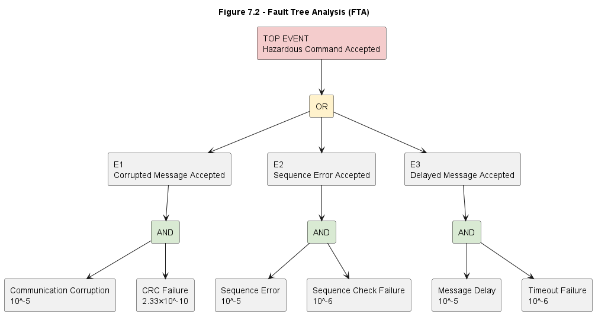

# 7 Safety Case

## 7.1 Introduction

A Safety Case is a structured argument supported by objective evidence demonstrating that a system is acceptably safe for its intended application [4].

Within railway systems, Safety Cases are required to justify that:

* Hazards have been identified.
* Risks have been assessed.
* Safety requirements have been derived.
* Safety mechanisms have been implemented.
* Verification activities have been completed.
* Residual risks remain acceptable.

According to EN 50129, a Safety Case must provide sufficient evidence that safety objectives are achieved throughout the system lifecycle [4].

For this project, the Safety Case focuses on demonstrating that the RaSTA communication architecture can safely support communication between railway applications operating over non-safe communication networks.

The Safety Case developed in this section uses:

* Hazard Analysis (Section 4)
* System Architecture (Section 5)
* Verification Evidence (Section 6)
* Fault Tree Analysis
* Residual Risk Assessment

to justify the safety of the proposed communication system.

---

## 7.2 Top-Level Safety Claim

### Safety Claim SC-1

**The RaSTA communication system prevents hazardous communication failures from causing unsafe railway system behaviour.**

This claim represents the primary safety objective of the communication architecture.

To justify this claim, four subordinate claims are established.

---

### SC-1.1 Hazard Identification and Control

**Claim**

Communication hazards have been identified and appropriate mitigation measures have been implemented.

**Supporting Evidence**

* Hazard Identification (Section 4.2)
* Risk Assessment (Section 4.4)
* Safety Function Derivation (Section 4.5)

References:

[1][3][10]

---

### SC-1.2 Communication Failures are Detected

**Claim**

Communication failures are detected before information is delivered to the application layer.

**Supporting Evidence**

* CRC Verification
* Sequence Supervision
* Time Supervision
* Endpoint Validation

References:

[5][6]

---

### SC-1.3 Fault Handling is Deterministic

**Claim**

Detected communication failures result in predictable and safe protocol behaviour.

**Supporting Evidence**

* Connection Supervision
* Safe-State Activation
* Session Management

References:

[1][4][6]

---

### SC-1.4 Residual Risk is Acceptable

**Claim**

The probability of hazardous communication failures remains within acceptable limits.

**Supporting Evidence**

* Reliability Analysis
* Availability Analysis
* Fault Tree Analysis
* THR Assessment

References:

[4][8][9]

---

## 7.3 Safety Argument Structure

The Safety Case can be represented using a goal-based argument structure.

```text
SC-1
│
├── SC-1.1 Hazards Identified
│
├── SC-1.2 Communication Errors Detected
│
├── SC-1.3 Safe Failure Behaviour
│
└── SC-1.4 Residual Risk Acceptable
```

This structure follows the argumentation principles commonly applied in railway safety assessments [4].

---

## 7.4 Safety Evidence Summary

The Safety Case relies upon evidence collected throughout the project lifecycle.

### Hazard Analysis Evidence

Provided by:

* Section 4

Demonstrates:

* Hazard identification
* Risk classification
* Safety function derivation

---

### Architectural Evidence

Provided by:

* Section 5

Demonstrates:

* Safety mechanism implementation
* Architectural traceability
* Hazard mitigation structure

---

### Verification Evidence

Provided by:

* Section 6

Demonstrates:

* Correct protocol operation
* Reliability achievement
* Availability achievement
* Requirement compliance

---

### Quantitative Evidence

Provided by:

* Reliability calculations
* CRC analysis
* Reliability Block Diagram analysis

Demonstrates:

* Dependability performance
* Error detection effectiveness

---

## 7.5 Safety Requirement Satisfaction

The safety requirements established in Section 3 can be evaluated against available evidence.

| Safety Requirement                        | Evidence                  |
| ----------------------------------------- | ------------------------- |
| SR-1 Corrupted Message Rejection          | CRC Analysis              |
| SR-2 Duplicate Message Rejection          | Sequence Monitoring       |
| SR-3 Sequence Error Detection             | Sequence Verification     |
| SR-4 Delay Detection                      | Time Supervision          |
| SR-5 Communication Interruption Detection | Connection Monitoring     |
| SR-6 Invalid Endpoint Detection           | Endpoint Validation       |
| SR-7 Safe-State Activation                | Fault Handling Procedures |

The analysis demonstrates that every safety requirement is supported by at least one dedicated safety mechanism.

---

## 7.6 Functional Safety Assessment Perspective

Functional Safety requires that:

1. Hazards are identified.
2. Risks are evaluated.
3. Safety requirements are defined.
4. Safety functions are implemented.
5. Verification activities are completed.
6. Residual risks are assessed.

The project has completed all six activities.

This demonstrates compliance with the Functional Safety lifecycle described in IEC 61508 [1].

References:

[1][3][4]

## 7.7 Fault Tree Analysis (FTA)

### 7.7.1 Introduction

Fault Tree Analysis (FTA) is a top-down deductive analysis technique used to identify combinations of failures that can result in a hazardous event [9].

FTA is widely used in Functional Safety and railway engineering because it provides:

* Structured hazard analysis
* Quantitative risk estimation
* Identification of critical failure paths
* Support for Safety Case development

The purpose of the analysis is to evaluate the probability of hazardous communication failures occurring despite the protection mechanisms implemented within the RaSTA protocol.

---

### 7.7.2 Definition of the Top Event

The top event considered in this project is:

**T0 – Hazardous railway command accepted despite communication failure**

Examples include:

* Corrupted command accepted
* Incorrect command accepted
* Delayed command accepted
* Unauthorized command accepted

If such an event were to occur, incorrect information could potentially influence the behaviour of a safety-related railway application.

References:

[5][6]

---

### Figure 7.2 – Fault Tree Analysis



**Figure 7.2:** Fault Tree Analysis of hazardous communication failure within the RaSTA architecture [9].

---

### 7.7.3 Intermediate Events

The top event can occur through three primary failure paths.

#### Event E1 – Corrupted Message Accepted

A corrupted message reaches the application layer despite CRC protection.

This requires:

* Communication corruption occurs
* CRC detection fails

Both conditions must occur simultaneously.

---

#### Event E2 – Sequence Error Accepted

A sequence-related communication fault reaches the application layer.

This requires:

* Sequence error occurs
* Sequence verification fails

Both conditions must occur simultaneously.

---

#### Event E3 – Delayed Message Accepted

An outdated message reaches the application layer.

This requires:

* Excessive transmission delay occurs
* Timeout supervision fails

Both conditions must occur simultaneously.

---

### 7.7.4 Fault Tree Interpretation

The fault tree demonstrates that hazardous communication behaviour requires:

1. A communication fault.
2. Failure of the corresponding protection mechanism.

This is a direct consequence of the defense-in-depth design philosophy applied within the RaSTA architecture.

The probability of a hazardous communication event is therefore significantly lower than the probability of individual communication faults.

References:

[7][9]

---

## 7.8 Quantitative Fault Tree Analysis

### 7.8.1 Assumed Event Probabilities

To estimate the probability of the top event, conservative assumptions are adopted.

| Event                         | Probability  |
| ----------------------------- | ------------ |
| Communication Corruption      | 10⁻⁵         |
| CRC Failure                   | 2.33 × 10⁻¹⁰ |
| Sequence Verification Failure | 10⁻⁶         |
| Timeout Supervision Failure   | 10⁻⁶         |

These assumptions intentionally represent conservative conditions.

---

### 7.8.2 Probability of Event E1

For Event E1:

```text
P(E1)
=
P(Corruption)
×
P(CRC Failure)
```

Substituting:

```text
P(E1)
=
10^-5 × 2.33 × 10^-10
```

Result:

```text
P(E1)
=
2.33 × 10^-15
```

---

### 7.8.3 Probability of Event E2

For Event E2:

```text
P(E2)
=
10^-5 × 10^-6
```

Result:

```text
P(E2)
=
10^-11
```

---

### 7.8.4 Probability of Event E3

For Event E3:

```text
P(E3)
=
10^-5 × 10^-6
```

Result:

```text
P(E3)
=
10^-11
```

---

### 7.8.5 Top Event Probability

For rare independent events:

```text
P(T0)
≈
P(E1)
+
P(E2)
+
P(E3)
```

Substituting:

```text
P(T0)
≈
2.33×10^-15
+
10^-11
+
10^-11
```

Result:

```text
P(T0)
≈
2 × 10^-11
```

---

### 7.8.6 Interpretation

The probability of a hazardous communication event is approximately:

```text
2 × 10^-11
```

per communication transaction.

This result demonstrates the effectiveness of the multiple protection layers implemented by the RaSTA protocol.

References:

[9]

---

## 7.9 Tolerable Hazard Rate (THR) Assessment

### 7.9.1 Definition

The Tolerable Hazard Rate (THR) represents the maximum acceptable frequency of hazardous failures within a safety-related system [4].

THR is commonly used within railway Functional Safety assessments to determine whether a system achieves an acceptable level of risk.

---

### 7.9.2 Typical Railway Targets

For safety-related railway functions, tolerable hazard rates typically fall within the range:

```text
10^-9
to
10^-8
failures/hour
```

References:

[4]

---

### 7.9.3 Comparison with Calculated Result

Calculated Hazard Probability:

```text
2 × 10^-11
```

Required Threshold:

```text
10^-9
```

Comparison:

```text
2 × 10^-11
<
10^-9
```

---

### 7.9.4 THR Verification Result

Verification Result:

✔ THR Requirement Satisfied

The estimated hazardous event probability remains significantly below commonly accepted railway safety targets.

This provides strong evidence supporting the safety of the communication architecture.

References:

[4][9]

---

## 7.10 Residual Risk Assessment

### 7.10.1 Introduction

Residual risk represents the risk that remains after all safety measures have been implemented [1].

No engineering system can completely eliminate risk.

Instead, Functional Safety seeks to reduce risk to a level that is As Low As Reasonably Practicable (ALARP).

References:

[1]

---

### 7.10.2 Remaining Risk Sources

Potential residual contributors include:

* Common-cause failures
* Software design defects
* Incorrect configuration
* Maintenance errors
* Human factors
* Unexpected operating conditions

These factors are difficult to eliminate completely and therefore remain contributors to residual risk.

---

### 7.10.3 Risk Reduction Measures

Residual risks are controlled through:

* Verification activities
* Validation activities
* Configuration management
* Change management
* Independent assessment
* Operational procedures

These measures reduce the probability that residual failures result in hazardous consequences.

---

### 7.10.4 Residual Risk Conclusion

The quantitative analyses performed throughout this project indicate that residual communication risk remains extremely low.

The combination of:

* CRC protection
* Sequence supervision
* Time supervision
* Connection supervision
* Safe-state activation

provides a robust safety architecture capable of reducing communication-related hazards to acceptable levels.

Verification Result:

✔ Residual Risk Acceptable
